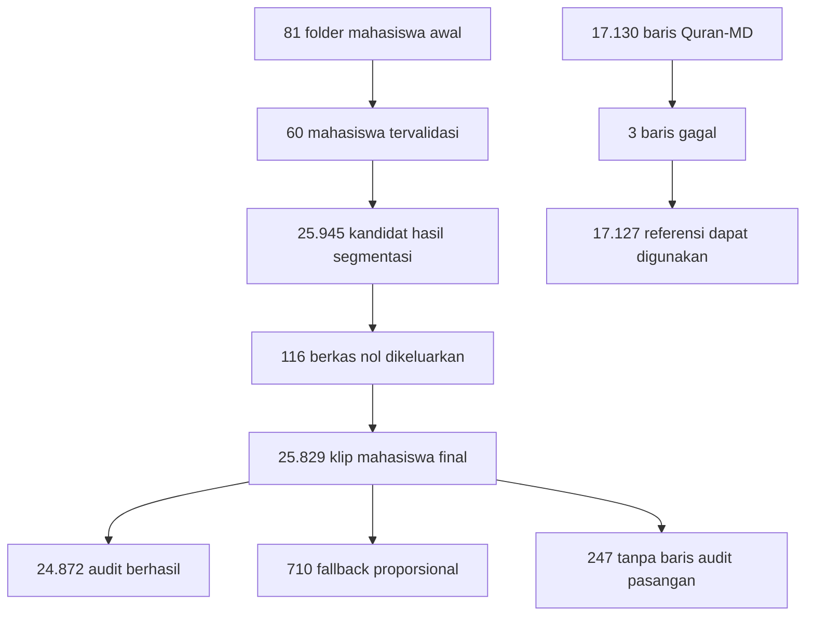
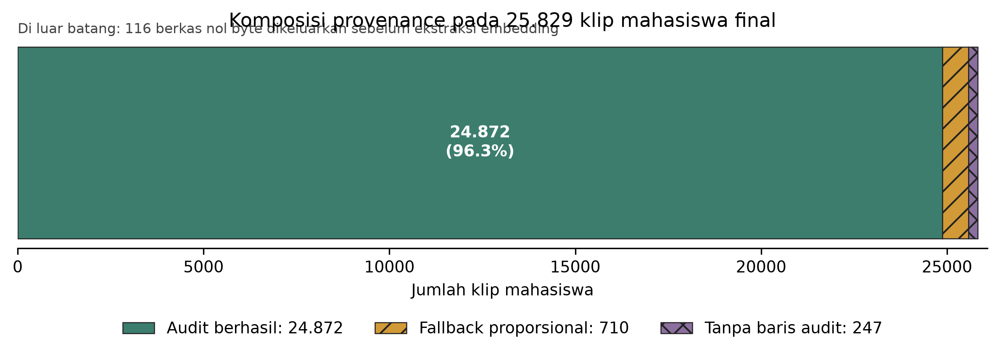
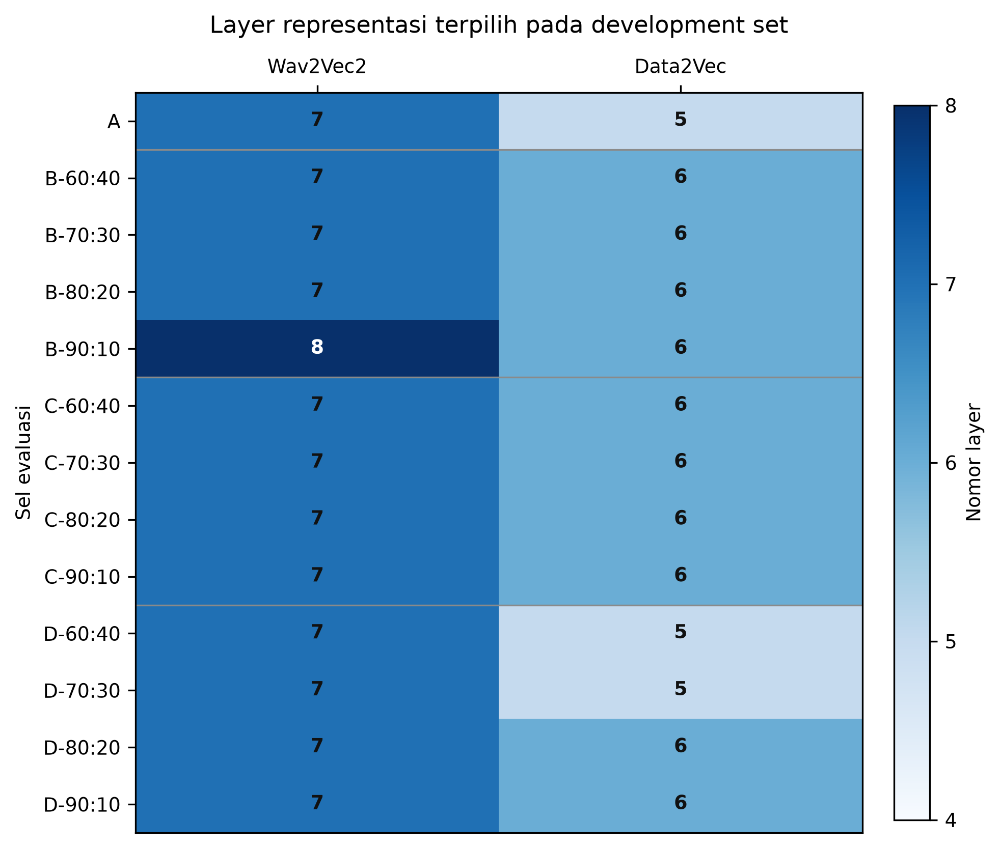
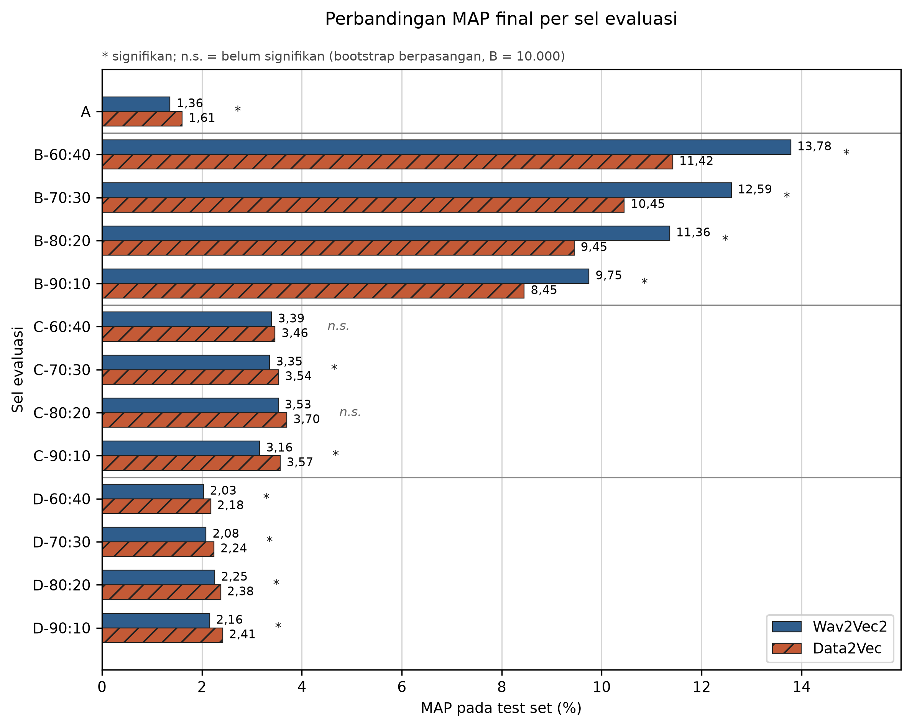
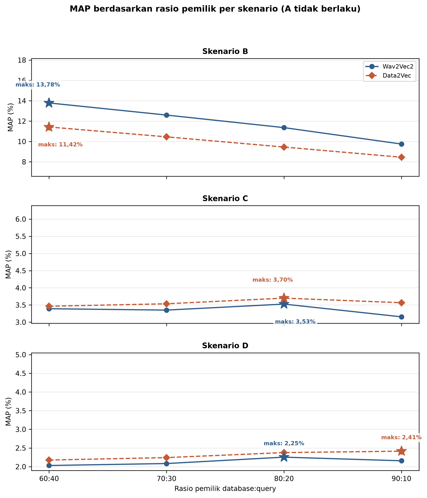
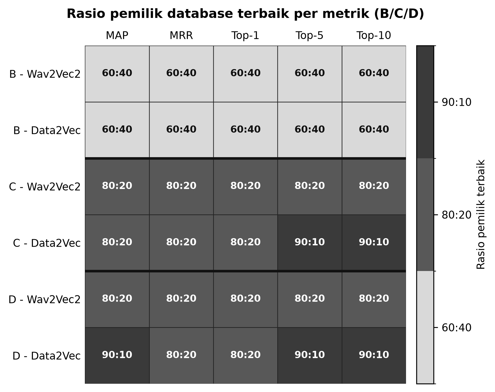
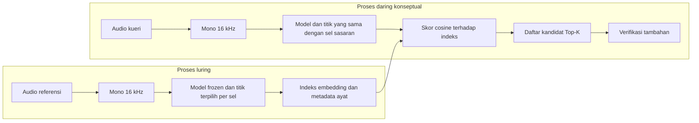

# BAB IV HASIL DAN PEMBAHASAN

Bab ini menyajikan hasil rekonsiliasi korpus, ekstraksi representasi, pemilihan titik, evaluasi akhir, dan perbandingan statistik pada 13 sel. Seluruh angka kinerja berasal dari protokol final dengan pemilihan konfigurasi pada himpunan pengembangan (_development set_) dan pelaporan pada himpunan pengujian (_test set_) yang terkunci.

## 4.1 Hasil Business Understanding

Fase _business understanding_ menghasilkan definisi keberhasilan yang berfokus pada validitas eksperimen dan kemampuan menjawab pertanyaan penelitian. Alur Wav2Vec2 dan Data2Vec berhasil diimplementasikan untuk menghasilkan embedding per titik, membentuk peringkat berdasarkan skor kosinus, serta mengukur peringkat dengan metrik _retrieval_ pada 13 sel. Keberhasilan ini tidak berarti sistem telah memenuhi ambang operasional tertentu, sebab penelitian tidak menetapkan MAP atau Top-K minimum.

Perbandingan dirancang adil melalui empat pengendalian. Pertama, kedua model menerima baris audio yang identik setelah _union filtering_. Kedua, dimensi embedding dan metode _mean pooling_ dibuat sama. Ketiga, relevansi ditentukan oleh label surah dan ayat yang sama. Keempat, titik terbaik dipilih pada _development set_ per sel dan hasil akhir hanya dihitung pada _test set_ yang tidak dipakai dalam pemilihan.

Tiga belas sel memberi konteks terhadap angka kinerja. Skenario A mewakili penggunaan lintas domain yang paling dekat dengan pencarian bacaan mahasiswa terhadap Quran-MD. Skenario B mengurangi perbedaan sumber akuisisi karena kedua sisi berasal dari Quran-MD, tetapi tetap memisahkan qari pada empat rasio. Skenario C mempertahankan karakteristik rekaman dan segmentasi mahasiswa pada kedua sisi sambil memisahkan identitas mahasiswa pada empat rasio. Skenario D menguji kueri mahasiswa melawan basis data gabungan yang lebih besar, yaitu mahasiswa lain dan seluruh Quran-MD, pada empat rasio. Susunan ini memungkinkan pembahasan beralih dari pertanyaan "model mana yang paling baik" menuju pertanyaan yang lebih tepat, yaitu "model mana yang lebih baik pada sel dan metrik tertentu".

## 4.2 Hasil Data Understanding

Rekonsiliasi data membedakan jumlah pada tahap pengumpulan, segmentasi, validasi, dan ekstraksi. Pemisahan ini mencegah angka dari tahap yang berbeda disajikan seolah-olah merujuk pada populasi yang sama.

Gambar 4.1 merangkum perubahan korpus mahasiswa dan Quran-MD sampai siap dipakai. Diagram juga menampilkan tiga kategori _provenance_ klip mahasiswa yang jumlahnya tepat sama dengan total kueri final.

**Gambar 4.1 Rekonsiliasi korpus dan provenance data final**

Alur tersebut menunjukkan bahwa 81 adalah jumlah folder mahasiswa pada pengumpulan awal, sedangkan 60 adalah mahasiswa yang lolos validasi teknis untuk eksperimen. Sebanyak 116 berkas nol dikeluarkan sebelum ekstraksi, bukan dihitung sebagai kegagalan model. Pada Quran-MD, tiga kegagalan terjadi saat pemrosesan 17.130 baris referensi dan dikeluarkan secara identik dari kedua model.

| Tahap atau kategori                  | Jumlah | Status dan penjelasan                                                   |
| ------------------------------------ | -----: | ----------------------------------------------------------------------- |
| Folder mahasiswa awal                |     81 | Populasi folder pada awal pengumpulan                                   |
| Mahasiswa tervalidasi                |     60 | Memenuhi pemeriksaan teknis dan struktur data                           |
| Kandidat hasil segmentasi            | 25.945 | Seluruh berkas kandidat sebelum pemeriksaan ukuran                      |
| Berkas nol byte                      |    116 | Dikeluarkan sebelum ekstraksi embedding                                 |
| Klip mahasiswa final                 | 25.829 | Seluruhnya berhasil diekstraksi oleh kedua model                        |
| _Provenance_ audit berhasil          | 24.872 | Berasal dari rekaman dengan catatan audit berhasil                      |
| _Provenance_ fallback\* proporsional |    710 | Hasil alokasi waktu proporsional                                        |
| Tanpa baris audit pasangan           |    247 | Tetap terlacak pada manifes, tetapi tidak memiliki pasangan baris audit |
| Baris referensi Quran-MD awal        | 17.130 | Kandidat ekstraksi referensi                                            |
| Baris referensi gagal                |      3 | Dikeluarkan dengan _union filtering_                                    |
| Referensi Quran-MD dapat digunakan   | 17.127 | Baris final yang identik untuk kedua model                              |

**Tabel 4.1 Rekonsiliasi validasi korpus final**

Jumlah kategori _provenance_ mahasiswa konsisten karena 24.872 + 710 + 247 = 25.829. Kategori tersebut tidak boleh ditafsirkan sebagai penilaian manual mutu batas ayat. Label audit menjelaskan jalur proses dan ketersediaan catatan, sedangkan ketepatan fonetik batas masih memerlukan anotasi manual yang tidak tersedia dalam penelitian ini.

**Gambar 4.2 Ringkasan provenance korpus mahasiswa final**

Gambar 4.2 memvisualisasikan komposisi provenance dari 25.829 klip mahasiswa yang digunakan. Sebagian besar klip berasal dari rekaman dengan audit berhasil (24.872 klip), sedangkan 710 klip menggunakan fallback pembagian waktu proporsional dan 247 klip tidak memiliki pasangan baris audit. Sebanyak 116 berkas nol byte tidak termasuk dalam batang karena telah dikeluarkan sebelum ekstraksi embedding. Visualisasi ini memperjelas bahwa kategori provenance merupakan status jalur pemrosesan, bukan bukti penilaian manual terhadap ketepatan batas ayat.

## 4.3 Hasil Data Preparation

Persiapan data menghasilkan gelombang masukan mono 16 kHz, identitas ayat yang seragam, manifes berurutan, dan kelompok kueri yang menjaga cakupan kelas sesuai protokol final. Format sumber tidak dipaksakan menjadi satu klaim konversi khusus. Rekaman media dibaca dan dinormalisasi secara netral terhadap format, sedangkan potongan hasil segmentasi mahasiswa dapat berupa MP3.

WhisperX menghasilkan stempel waktu kata. Batas ayat tidak diberikan langsung oleh WhisperX, tetapi dihitung melalui alokasi urutan kata berdasarkan jumlah kata per ayat. Ketika jalur tersebut tidak tersedia atau tidak dapat dipakai, sistem menggunakan pembagian waktu proporsional. Hasil akhirnya dapat diproses secara otomatis dalam skala besar, tetapi validasinya tetap bersifat teknis dan _provenance_. Tidak dilakukan pemeriksaan manual menyeluruh yang membuktikan ketepatan setiap batas.

Audit kebocoran pada seluruh sel B, C, dan D memastikan tidak ada identitas pemilik yang muncul di kedua sisi dan tidak ada jalur berkas yang sama antara kueri dan basis data. Seluruh audit lolos tanpa temuan kebocoran.

### 4.3.1 Pemisahan Dataset dan Peran Sumber

Eksperimen ini menggunakan beberapa jenis pemisahan data sesuai dengan tujuan setiap skenario. Perbedaan tersebut diperlukan karena setiap skenario dirancang untuk menguji kondisi generalisasi yang berbeda, yaitu pencarian lintas sumber data, pencarian antar-pemilik pada sumber yang sama, dan pencarian menggunakan basis data gabungan. Oleh karena itu, pembagian data tidak hanya dilakukan berdasarkan jumlah klip, tetapi juga mempertimbangkan sumber data dan identitas pemilik setiap klip.

Sebelum pembagian kueri dan basis data dilakukan, seluruh data terlebih dahulu diproses melalui ekstraksi _embedding_ menggunakan Wav2Vec2 dan Data2Vec. Baris data yang gagal diekstraksi pada salah satu model dikeluarkan dari kedua model menggunakan prinsip _union filtering_. Prosedur ini diterapkan agar kedua model dievaluasi menggunakan baris audio yang identik. Dengan demikian, perbedaan kinerja antarmodel tidak disebabkan oleh perbedaan jumlah kueri atau dokumen basis data yang tersedia untuk masing-masing model.

Pada data Quran-MD, terdapat 17.130 baris referensi pada tahap awal. Sebanyak 3 baris gagal diekstraksi dan dikeluarkan secara identik dari keluaran kedua model. Setelah proses tersebut, tersisa 17.127 baris Quran-MD yang dapat digunakan dalam eksperimen. Sementara itu, seluruh 25.829 klip mahasiswa berhasil diekstraksi oleh Wav2Vec2 dan Data2Vec sehingga tidak ada klip mahasiswa yang dikeluarkan melalui _union filtering_. Jumlah akhir inilah yang digunakan sebagai dasar pembentukan kueri dan basis data pada seluruh skenario.

**Skenario A: Pemisahan Lintas Sumber Data**

Skenario A menggunakan seluruh 25.829 klip mahasiswa sebagai kueri dan seluruh 17.127 klip Quran-MD sebagai basis data. Pada skenario ini tidak dilakukan pemisahan berdasarkan pemilik karena kedua sisi berasal dari sumber data yang berbeda. Kueri berasal dari rekaman mahasiswa, sedangkan basis data berasal dari Quran-MD.

Skenario A merepresentasikan kondisi pencarian lintas sumber data. Dalam kondisi ini, sistem diuji untuk menemukan ayat pada Quran-MD berdasarkan rekaman bacaan mahasiswa. Karena seluruh klip mahasiswa ditempatkan sebagai kueri dan seluruh klip Quran-MD ditempatkan sebagai basis data, Skenario A hanya menghasilkan satu sel evaluasi dan tidak menggunakan variasi rasio pemilik.

**Skenario B, C, dan D: Pemisahan Berdasarkan Pemilik**

Berbeda dari Skenario A, Skenario B, C, dan D menggunakan pemisahan berdasarkan pemilik (_owner-based split_). Pendekatan ini digunakan karena satu pemilik dapat memiliki beberapa klip audio. Jika klip dari pemilik yang sama ditempatkan pada sisi kueri dan basis data secara bersamaan, model berpotensi diuji pada rekaman atau karakteristik pembaca yang telah muncul pada kedua sisi. Oleh sebab itu, seluruh klip dari satu pemilik ditempatkan pada sisi yang sama.

Pemilik pada setiap skenario didefinisikan sebagai berikut:

- **Skenario B:** pemilik adalah qari atau pembaca pada dataset Quran-MD. Setiap qari dapat memiliki beberapa klip ayat.
- **Skenario C:** pemilik adalah mahasiswa berdasarkan NIM. Setiap mahasiswa dapat memiliki beberapa klip hasil segmentasi.
- **Skenario D:** pemilik kueri adalah mahasiswa, sedangkan basis data terdiri atas klip mahasiswa lain yang tidak menjadi sumber kueri serta seluruh klip Quran-MD.

Identitas pemilik terlebih dahulu diurutkan agar urutan awalnya deterministik, kemudian dipermutasi menggunakan generator bilangan acak dengan _seed_ 42. Berdasarkan hasil permutasi tersebut, pemilik dibagi ke sisi basis data dan kueri sesuai dengan rasio 60:40, 70:30, 80:20, dan 90:10. Angka pertama menyatakan proporsi pemilik pada sisi basis data, sedangkan angka kedua menyatakan proporsi pemilik pada sisi kueri. Sebagai contoh, rasio 70:30 berarti 70% pemilik ditempatkan pada sisi basis data dan 30% sisanya ditempatkan pada sisi kueri. Penggunaan _seed_ yang sama memastikan bahwa pembagian tersebut dapat direproduksi secara konsisten.

Pada Skenario B terdapat 30 qari. Rasio 60:40 menghasilkan 12 qari pada sisi kueri dan 18 qari pada sisi basis data. Rasio 70:30 menghasilkan 9 qari pada sisi kueri dan 21 qari pada sisi basis data. Rasio 80:20 menghasilkan 6 qari pada sisi kueri dan 24 qari pada sisi basis data. Sementara itu, rasio 90:10 menghasilkan 3 qari pada sisi kueri dan 27 qari pada sisi basis data.

Pada Skenario C dan D terdapat 60 mahasiswa. Rasio 60:40 menghasilkan 24 mahasiswa pada sisi kueri dan 36 mahasiswa pada sisi basis data. Rasio 70:30 menghasilkan 18 mahasiswa pada sisi kueri dan 42 mahasiswa pada sisi basis data. Rasio 80:20 menghasilkan 12 mahasiswa pada sisi kueri dan 48 mahasiswa pada sisi basis data. Rasio 90:10 menghasilkan 6 mahasiswa pada sisi kueri dan 54 mahasiswa pada sisi basis data. Penggunaan _seed_ 42 memastikan bahwa pembagian identitas pemilik dapat direproduksi secara konsisten pada seluruh sel eksperimen.

Pada Skenario B, kedua sisi berasal dari Quran-MD, tetapi qari pada sisi kueri berbeda dari qari pada sisi basis data. Oleh karena itu, skenario ini menguji kemampuan model dalam melakukan pencarian ayat dari pembaca yang berbeda dengan pembaca pada basis data referensi. Perubahan rasio pemilik menyebabkan jumlah qari dan klip pada kedua sisi ikut berubah. Semakin besar proporsi pemilik yang ditempatkan pada basis data, semakin banyak pula klip referensi yang tersedia untuk proses pemeringkatan.

Skenario C menggunakan rekaman mahasiswa pada kedua sisi. Mahasiswa yang klipnya digunakan sebagai kueri tidak ditempatkan kembali pada basis data. Dengan demikian, pencarian pada Skenario C dilakukan terhadap klip mahasiswa lain yang tidak memiliki pemilik yang sama dengan kueri. Skenario ini digunakan untuk menguji generalisasi model terhadap perbedaan pembaca dalam sumber data mahasiswa.

Skenario D menggunakan kueri yang sama dengan Skenario C pada rasio pemilik yang bersesuaian. Perbedaannya terletak pada pembentukan basis data. Basis data Skenario D merupakan gabungan seluruh klip mahasiswa yang bukan milik kueri dan seluruh 17.127 klip Quran-MD. Karena menambahkan seluruh Quran-MD, ukuran basis data Skenario D selalu lebih besar daripada basis data Skenario C pada rasio pemilik yang sama. Penambahan Quran-MD tersebut memungkinkan pengujian pada kondisi basis data yang mencakup lebih dari satu sumber data.

**Pencegahan Kebocoran Data**

Pemisahan berdasarkan pemilik kemudian diverifikasi melalui audit kebocoran data. Audit ini dilakukan untuk memastikan bahwa pemisahan yang telah ditetapkan benar-benar menghasilkan kueri dan basis data yang saling terpisah. Pemeriksaan dilakukan pada tingkat identitas pemilik dan jalur berkas karena kebocoran dapat terjadi apabila salah satu dari kedua aspek tersebut masih tumpang tindih.

Audit kebocoran mencakup pemeriksaan berikut:

1. tidak ada pemilik yang muncul pada sisi kueri dan basis data secara bersamaan;
2. tidak ada jalur berkas yang sama antara kueri dan basis data; dan
3. khusus pada Skenario D, basis data hanya terdiri atas mahasiswa yang bukan pemilik kueri serta seluruh data Quran-MD.

Pada Skenario B, pemeriksaan identitas dilakukan terhadap qari. Pada Skenario C dan D, pemeriksaan dilakukan terhadap NIM mahasiswa. Selain pemeriksaan identitas, jalur berkas setiap klip juga dibandingkan untuk memastikan bahwa satu berkas audio tidak muncul pada kedua sisi, baik dengan identitas yang sama maupun melalui duplikasi pada manifes.

Seluruh audit kebocoran pada Skenario B, C, dan D berhasil dilalui tanpa temuan. Tidak terdapat pemilik yang muncul pada kedua sisi dan tidak terdapat jalur berkas yang sama antara kueri dan basis data. Dengan demikian, hasil evaluasi pada ketiga skenario tersebut tidak berasal dari perbandingan langsung terhadap rekaman atau pemilik yang sama.

**Penyaringan Cakupan Kueri**

Setelah pembagian berdasarkan pemilik selesai, dilakukan pemeriksaan cakupan kelas relevan pada sisi basis data. Sebuah kueri harus memiliki sedikitnya satu dokumen relevan di dalam basis data agar dapat digunakan untuk menghitung metrik _retrieval_. Dokumen relevan ditentukan berdasarkan pasangan label `(surah, ayat)`, bukan berdasarkan identitas qari atau mahasiswa.

Kueri yang tidak memiliki dokumen dengan pasangan `(surah, ayat)` yang sesuai di dalam basis data dikeluarkan melalui proses penyaringan cakupan. Penyaringan ini diterapkan setelah pembentukan kueri dan basis data karena ketersediaan dokumen relevan bergantung pada komposisi basis data di setiap skenario dan rasio pemilik. Setelah penyaringan dilakukan, seluruh kueri yang masuk ke tahap evaluasi memiliki sedikitnya satu dokumen relevan.

Dengan prosedur tersebut, nilai AP nol tidak muncul semata-mata karena kelas relevan tidak tersedia di dalam basis data. Proses ini juga memastikan bahwa metrik yang dihitung merefleksikan kemampuan model dalam menempatkan dokumen relevan pada peringkat tinggi, bukan ketiadaan dokumen pembanding yang diperlukan.

**Pembagian Development dan Test**

Setelah kueri melewati penyaringan cakupan, kueri dibagi menjadi _development set_ dan _test set_. Pembagian ini dilakukan secara terstratifikasi berdasarkan pasangan `(surah, ayat)` menggunakan _seed_ 42. Tujuannya adalah menjaga agar pasangan ayat yang tersedia pada data kueri tetap terwakili pada kedua himpunan sebanyak mungkin.

Pada setiap kelompok pasangan `(surah, ayat)`, indeks kueri diacak secara deterministik. Sekitar 70% klip pada setiap kelompok dimasukkan ke dalam _development set_ dengan aturan pembulatan ke bawah dan paling sedikit satu klip, sedangkan indeks yang tersisa dimasukkan ke dalam _test set_. Karena pembulatan diterapkan secara terpisah pada setiap kelompok ayat, proporsi akhir klip pada _development set_ tidak selalu tepat 70% dari total kueri. Pada seluruh sel, proporsi aktual _development set_ berada pada kisaran 57,9% hingga 69,1%.

_Development set_ digunakan untuk menyapu seluruh 13 titik representasi, yaitu titik 0 sampai 12, pada masing-masing model. Titik representasi dengan nilai MAP _development_ tertinggi dipilih secara terpisah untuk setiap kombinasi sel dan model. Setelah titik representasi ditentukan, konfigurasi tersebut dikunci dan tidak diubah berdasarkan hasil _test set_.

Sebaliknya, _test set_ tidak digunakan selama proses pemilihan titik representasi. Himpunan ini hanya dibuka setelah konfigurasi final ditetapkan untuk menghasilkan evaluasi akhir berupa MAP, MRR, Top-1, Top-5, dan Top-10. Pemisahan tersebut menjaga agar data pengujian tetap berfungsi sebagai evaluasi yang tidak digunakan untuk mengambil keputusan konfigurasi.

Dengan demikian, setiap sel eksperimen memiliki alur pemisahan yang konsisten: data disaring menggunakan _union filtering_, sumber dan pemilik ditentukan sesuai skenario, kebocoran identitas serta jalur berkas diaudit, kueri tanpa dokumen relevan dikeluarkan, kemudian kueri yang tersisa dibagi menjadi _development set_ dan _test set_. Urutan ini memastikan bahwa perbedaan hasil antarskenario dapat ditafsirkan berdasarkan perbedaan sumber data, pemilik, dan ukuran basis data, bukan karena ketidakkonsistenan proses persiapan atau kebocoran data.

### 4.3.2 Matriks ukuran 13 sel

Tabel 4.2 menyajikan ukuran kueri dan basis data untuk setiap sel. Angka pada sisi kueri dan basis data adalah ukuran yang benar-benar digunakan untuk membentuk peringkat setelah cakupan filter.

| Sel     | Sumber kueri | Jumlah kueri | Sumber basis data    | Jumlah basis data | Pemisahan pemilik                                       |
| ------- | ------------ | -----------: | -------------------- | ----------------: | ------------------------------------------------------- |
| A       | Mahasiswa    |       25.829 | Quran-MD             |            17.127 | Lintas sumber data                                      |
| B-60:40 | Quran-MD     |        6.849 | Quran-MD             |            10.278 | 12 qari berbanding 18 qari                              |
| B-70:30 | Quran-MD     |        5.139 | Quran-MD             |            11.988 | 9 qari berbanding 21 qari                               |
| B-80:20 | Quran-MD     |        3.426 | Quran-MD             |            13.701 | 6 qari berbanding 24 qari                               |
| B-90:10 | Quran-MD     |        1.713 | Quran-MD             |            15.414 | 3 qari berbanding 27 qari                               |
| C-60:40 | Mahasiswa    |        9.386 | Mahasiswa            |            16.443 | 24 mahasiswa berbanding 36 mahasiswa                    |
| C-70:30 | Mahasiswa    |        6.995 | Mahasiswa            |            18.834 | 18 mahasiswa berbanding 42 mahasiswa                    |
| C-80:20 | Mahasiswa    |        4.118 | Mahasiswa            |            21.711 | 12 mahasiswa berbanding 48 mahasiswa                    |
| C-90:10 | Mahasiswa    |        1.833 | Mahasiswa            |            23.996 | 6 mahasiswa berbanding 54 mahasiswa                     |
| D-60:40 | Mahasiswa    |        9.386 | Mahasiswa + Quran-MD |            33.570 | 24 mahasiswa berbanding 36 mahasiswa + seluruh Quran-MD |
| D-70:30 | Mahasiswa    |        6.995 | Mahasiswa + Quran-MD |            35.961 | 18 mahasiswa berbanding 42 mahasiswa + seluruh Quran-MD |
| D-80:20 | Mahasiswa    |        4.118 | Mahasiswa + Quran-MD |            38.838 | 12 mahasiswa berbanding 48 mahasiswa + seluruh Quran-MD |
| D-90:10 | Mahasiswa    |        1.833 | Mahasiswa + Quran-MD |            41.123 | 6 mahasiswa berbanding 54 mahasiswa + seluruh Quran-MD  |

**Tabel 4.2 Matriks ukuran kueri dan basis data pada 13 sel**

Seluruh kueri pada setiap sel memiliki sedikitnya satu dokumen relevan, sehingga AP nol tidak muncul hanya karena kelas relevan tidak tersedia. Basis data D selalu lebih besar daripada basis data C pada rasio yang sama karena D menambahkan seluruh 17.127 klip Quran-MD.

## 4.4 Hasil Modeling

Ekstraksi final menghasilkan 13 matriks per model dan per himpunan data. Setiap klip mula-mula menghasilkan checkpoint `(13, 768)`, lalu baris dengan titik yang sama dirakit ke `layer_00.npy` sampai `layer_12.npy`. Setiap matriks akhir berbentuk `(N, 768)`, dan baris ke-$i$ selalu sejalan dengan baris ke-$i$ pada manifes. `progress.json` mencatat kemajuan pemrosesan, sedangkan metadata kegagalan menjaga alasan eksklusi tetap dapat ditelusuri.

Seluruh 25.829 klip mahasiswa berhasil diproses oleh Wav2Vec2 dan Data2Vec. Dengan demikian, ekstraksi kueri final tidak memiliki baris yang ditandai gagal. Pada Quran-MD, tiga dari 17.130 baris ditandai gagal. _Union filtering_ mengeluarkan ketiga indeks tersebut dari hasil kedua model dan menyisakan 17.127 baris identik. Keluaran non-_finite_ telah ditolak oleh ekstraktor, sedangkan validasi artefak akhir memastikan keberadaan 13 matriks, bentuk `(N, 768)`, tipe `float32`, dan keselarasan jumlah baris dengan manifes.

### 4.4.1 Pemilihan Titik Representasi per Sel

Pemilihan titik representasi dilakukan melalui penyapuan sistematis pada _development set_ untuk setiap sel dan model. Protokol ini memastikan bahwa pemilihan konfigurasi tidak menggunakan data pengujian, sehingga evaluasi akhir tetap tidak bias.

**Protokol Pemilihan**

1. Untuk setiap sel (13 sel) dan setiap model (Wav2Vec2, Data2Vec), lakukan penyapuan 13 titik (layer 0-12)
2. Hitung MAP pada _development set_ untuk setiap kombinasi sel-model-titik
3. Pilih titik dengan MAP tertinggi pada _development set_
4. Jika terjadi seri (tie), pilih titik terendah (layer lebih kecil)
5. Gunakan titik terpilih untuk evaluasi akhir pada _test set_

Total evaluasi: 13 sel × 2 model × 13 titik = 338 evaluasi development.

**Aturan Pemilihan**
Aturan pemilihan titik adalah **MAP development tertinggi**. Jika terjadi seri sempurna pada MAP (yang tidak terjadi pada eksperimen ini), aturan tambahan adalah memilih titik terendah. Aturan ini konsisten diterapkan pada seluruh 26 kombinasi sel-model (13 sel × 2 model).

**Hasil Pemilihan Titik**
Tabel 4.3 merangkum titik yang dipilih sebelum pengujian akhir untuk setiap sel dan model, beserta ukuran development dan test set.

| Sel     |  n_dev | n_test | Titik Wav2Vec2 | Titik Data2Vec |
| ------- | -----: | -----: | -------------: | -------------: |
| A       | 17.839 |  7.990 |              7 |              5 |
| B-60:40 |  4.565 |  2.284 |              7 |              6 |
| B-70:30 |  3.426 |  1.713 |              7 |              6 |
| B-80:20 |  2.284 |  1.142 |              7 |              6 |
| B-90:10 |  1.142 |    571 |              8 |              6 |
| C-60:40 |  6.357 |  3.029 |              7 |              6 |
| C-70:30 |  4.613 |  2.382 |              7 |              6 |
| C-80:20 |  2.616 |  1.502 |              7 |              6 |
| C-90:10 |  1.062 |    771 |              7 |              6 |
| D-60:40 |  6.357 |  3.029 |              7 |              5 |
| D-70:30 |  4.613 |  2.382 |              7 |              5 |
| D-80:20 |  2.616 |  1.502 |              7 |              6 |
| D-90:10 |  1.062 |    771 |              7 |              6 |

**Tabel 4.3 Pembagian development, test, dan titik representasi terpilih per sel**

Jumlah _development_ dan _test_ tepat menjumlah ke total kueri pada setiap sel. Data pengembangan digunakan untuk penyapuan 13 titik, sedangkan data pengujian tetap terkunci sampai titik terbaik ditetapkan. Karena itu, metrik akhir tidak menjadi dasar pemilihan konfigurasi.

Wav2Vec2 konsisten memilih titik 7 pada 12 dari 13 sel, kecuali B-90:10 yang memilih titik 8. Data2Vec memilih titik 5 pada A, D-60:40, dan D-70:30; titik 6 pada seluruh sel B dan C serta D-80:20 dan D-90:10. Hasil ini menunjukkan bahwa keluaran terakhir Transformer bukan pilihan terbaik untuk tugas ini. Representasi tengah tampak memberi keseimbangan yang lebih sesuai antara informasi akustik lokal dan konteks yang telah diolah model. Pernyataan tersebut merupakan interpretasi hasil _layerwise_, bukan bukti kausal mengenai isi setiap lapisan.

### 4.4.2 Penyapuan MAP Development per Skenario

Bagian ini menyajikan tabel lengkap MAP pada _development set_ untuk setiap skenario. Tabel-tabel ini menunjukkan bagaimana MAP berubah across layer 0-12 untuk setiap rasio pemilik. Setiap tabel menggunakan layer sebagai baris dan rasio sebagai kolom, dengan nilai MAP dalam persen (format Indonesia: koma sebagai desimal).

**Catatan Interpretasi**

- Nilai pada tabel ini adalah MAP _development_, digunakan untuk pemilihan titik
- Nilai MAP _test_ (evaluasi final) disajikan terpisah pada Bagian 4.5
- Setiap sel memiliki n_dev dan n_test yang berbeda (lihat Tabel 4.3)
- Layer terpilih (maksimum MAP) ditandai dengan **tebal**

#### Skenario A: Lintas Domain (Mahasiswa → Quran-MD)

Skenario A hanya memiliki satu konfigurasi karena tidak ada variasi rasio pemilik (seluruh mahasiswa vs. seluruh Quran-MD).

**Tabel 4.4a Penyapuan MAP development Skenario A (n_dev = 17.839)**

| Layer |  Wav2Vec2 |  Data2Vec |
| ----: | --------: | --------: |
|     0 |     0,31% |     0,39% |
|     1 |     0,39% |     0,51% |
|     2 |     0,48% |     0,80% |
|     3 |     0,55% |     1,18% |
|     4 |     0,72% |     1,48% |
|     5 |     1,11% | **1,58%** |
|     6 |     1,31% |     1,41% |
|     7 | **1,40%** |     1,18% |
|     8 |     1,27% |     1,03% |
|     9 |     0,93% |     0,91% |
|    10 |     0,80% |     0,92% |
|    11 |     0,58% |     0,71% |
|    12 |     0,48% |     0,56% |

Pada Skenario A, Wav2Vec2 mencapai MAP tertinggi pada layer 7 (1,40%), sedangkan Data2Vec mencapai MAP tertinggi pada layer 5 (1,58%). Data2Vec unggul pada layer rendah hingga tengah (layer 3-6), sedangkan Wav2Vec2 unggul pada layer tengah hingga tinggi (layer 7-8). Kedua model menunjukkan penurunan performa pada layer sangat rendah (0-2) dan sangat tinggi (10-12).

#### Skenario B: Quran-MD → Quran-MD (Pemisahan Qari)

Skenario B menggunakan Quran-MD untuk kedua sisi (kueri dan basis data) dengan pemisahan berdasarkan qari pada empat rasio berbeda.

**Tabel 4.4b Penyapuan MAP development Skenario B - Wav2Vec2**

| Layer | 60:40 (n=4.565) | 70:30 (n=3.426) | 80:20 (n=2.284) | 90:10 (n=1.142) |
| ----: | --------------: | --------------: | --------------: | --------------: |
|     0 |           0,91% |           0,88% |           0,74% |           0,68% |
|     1 |           1,65% |           1,59% |           1,35% |           1,20% |
|     2 |           2,76% |           2,62% |           2,27% |           1,98% |
|     3 |           3,82% |           3,56% |           3,10% |           2,74% |
|     4 |           5,53% |           5,21% |           4,50% |           3,80% |
|     5 |           9,30% |           8,93% |           7,67% |           5,94% |
|     6 |          11,78% |          11,11% |           9,66% |           7,44% |
|     7 |      **13,53%** |      **12,95%** |      **11,49%** |           8,98% |
|     8 |          12,97% |          12,58% |          11,15% |       **9,00%** |
|     9 |           9,39% |           9,03% |           7,99% |           6,55% |
|    10 |           7,26% |           7,15% |           6,46% |           5,52% |
|    11 |           4,35% |           4,32% |           4,05% |           3,60% |
|    12 |           3,18% |           3,19% |           3,06% |           2,63% |

**Tabel 4.4c Penyapuan MAP development Skenario B - Data2Vec**

| Layer | 60:40 (n=4.565) | 70:30 (n=3.426) | 80:20 (n=2.284) | 90:10 (n=1.142) |
| ----: | --------------: | --------------: | --------------: | --------------: |
|     0 |           1,17% |           1,16% |           1,01% |           0,93% |
|     1 |           2,35% |           2,04% |           1,75% |           1,65% |
|     2 |           4,26% |           3,79% |           3,24% |           3,04% |
|     3 |           7,14% |           6,58% |           5,37% |           4,60% |
|     4 |           9,95% |           9,38% |           7,92% |           6,57% |
|     5 |          11,02% |          10,38% |           9,08% |           7,40% |
|     6 |      **11,42%** |      **10,87%** |       **9,55%** |       **7,93%** |
|     7 |          10,10% |           9,53% |           8,32% |           6,55% |
|     8 |           8,53% |           8,10% |           7,12% |           5,63% |
|     9 |           7,30% |           7,01% |           6,24% |           5,13% |
|    10 |           7,34% |           7,15% |           6,31% |           5,12% |
|    11 |           5,06% |           4,99% |           4,51% |           3,63% |
|    12 |           3,12% |           3,15% |           2,83% |           2,49% |

Pada Skenario B, Wav2Vec2 secara konsisten memilih layer 7 untuk tiga rasio pertama (60:40, 70:30, 80:20) dan layer 8 untuk rasio 90:10. Data2Vec secara konsisten memilih layer 6 untuk seluruh empat rasio. Pola ini menunjukkan bahwa Wav2Vec2 memerlukan layer sedikit lebih tinggi untuk mencapai performa optimal pada rasio basis data yang sangat besar (90:10), sedangkan Data2Vec lebih stabil pada layer 6.

Pada rasio 90:10, Wav2Vec2 memilih layer 8 dengan MAP development 9,00%, sedikit lebih tinggi daripada layer 7 (8,98%). Tidak terjadi seri pada kasus ini; layer 8 unggul pada nilai tidak-terbulat dan tetap unggul setelah pembulatan dua desimal.

#### Skenario C: Mahasiswa → Mahasiswa (Pemisahan NIM)

Skenario C menggunakan klip mahasiswa untuk kedua sisi dengan pemisahan berdasarkan identitas mahasiswa (NIM).

**Tabel 4.4d Penyapuan MAP development Skenario C - Wav2Vec2**

| Layer | 60:40 (n=6.357) | 70:30 (n=4.613) | 80:20 (n=2.616) | 90:10 (n=1.062) |
| ----: | --------------: | --------------: | --------------: | --------------: |
|     0 |           0,38% |           0,35% |           0,33% |           0,33% |
|     1 |           0,49% |           0,47% |           0,45% |           0,44% |
|     2 |           0,60% |           0,57% |           0,56% |           0,53% |
|     3 |           0,77% |           0,73% |           0,73% |           0,68% |
|     4 |           1,18% |           1,12% |           1,14% |           1,04% |
|     5 |           2,52% |           2,40% |           2,51% |           2,12% |
|     6 |           3,36% |           3,20% |           3,36% |           2,86% |
|     7 |       **3,49%** |       **3,37%** |       **3,55%** |       **3,03%** |
|     8 |           2,85% |           2,71% |           2,83% |           2,35% |
|     9 |           2,05% |           1,96% |           2,02% |           1,72% |
|    10 |           1,67% |           1,63% |           1,65% |           1,42% |
|    11 |           1,04% |           1,00% |           1,00% |           0,90% |
|    12 |           0,84% |           0,80% |           0,79% |           0,70% |

**Tabel 4.4e Penyapuan MAP development Skenario C - Data2Vec**

| Layer | 60:40 (n=6.357) | 70:30 (n=4.613) | 80:20 (n=2.616) | 90:10 (n=1.062) |
| ----: | --------------: | --------------: | --------------: | --------------: |
|     0 |           0,45% |           0,43% |           0,41% |           0,38% |
|     1 |           0,79% |           0,74% |           0,71% |           0,66% |
|     2 |           1,39% |           1,32% |           1,31% |           1,10% |
|     3 |           2,31% |           2,25% |           2,28% |           1,81% |
|     4 |           3,35% |           3,25% |           3,33% |           2,58% |
|     5 |           3,72% |           3,63% |           3,77% |           2,87% |
|     6 |       **3,73%** |       **3,65%** |       **3,83%** |       **3,11%** |
|     7 |           2,95% |           2,86% |           2,98% |           2,47% |
|     8 |           2,43% |           2,32% |           2,44% |           2,07% |
|     9 |           2,16% |           2,06% |           2,21% |           1,85% |
|    10 |           2,20% |           2,09% |           2,25% |           1,91% |
|    11 |           1,68% |           1,59% |           1,67% |           1,45% |
|    12 |           1,12% |           1,05% |           1,07% |           0,93% |

Pada Skenario C, Wav2Vec2 secara konsisten memilih layer 7 untuk seluruh empat rasio. Data2Vec secara konsisten memilih layer 6 untuk seluruh empat rasio. Pola ini sangat stabil dan menunjukkan bahwa karakteristik data mahasiswa (dengan variasi akuisisi dan segmentasi) cocok dengan representasi pada layer tengah.

Perlu dicatat bahwa pada beberapa rasio, MAP Data2Vec layer 5 dan layer 6 sangat dekat (misalnya C-60:40: 3,72% vs 3,73%), tetapi layer 6 dipilih karena MAP sedikit lebih tinggi.

#### Skenario D: Mahasiswa → Mahasiswa + Quran-MD (Basis Data Gabungan)

Skenario D menggunakan klip mahasiswa sebagai kueri dan basis data gabungan (mahasiswa lain + seluruh Quran-MD). Skenario ini menguji performa pada basis data yang lebih besar dan lebih heterogen.

**Tabel 4.4f Penyapuan MAP development Skenario D - Wav2Vec2**

| Layer | 60:40 (n=6.357) | 70:30 (n=4.613) | 80:20 (n=2.616) | 90:10 (n=1.062) |
| ----: | --------------: | --------------: | --------------: | --------------: |
|     0 |           0,29% |           0,28% |           0,28% |           0,28% |
|     1 |           0,37% |           0,36% |           0,36% |           0,36% |
|     2 |           0,44% |           0,44% |           0,44% |           0,45% |
|     3 |           0,54% |           0,53% |           0,55% |           0,55% |
|     4 |           0,77% |           0,77% |           0,80% |           0,79% |
|     5 |           1,50% |           1,49% |           1,63% |           1,47% |
|     6 |           1,97% |           1,96% |           2,14% |           1,91% |
|     7 |       **2,06%** |       **2,08%** |       **2,26%** |       **2,00%** |
|     8 |           1,73% |           1,72% |           1,85% |           1,57% |
|     9 |           1,25% |           1,25% |           1,33% |           1,14% |
|    10 |           1,03% |           1,04% |           1,11% |           0,95% |
|    11 |           0,65% |           0,66% |           0,68% |           0,62% |
|    12 |           0,54% |           0,53% |           0,55% |           0,50% |

**Tabel 4.4g Penyapuan MAP development Skenario D - Data2Vec**

| Layer | 60:40 (n=6.357) | 70:30 (n=4.613) | 80:20 (n=2.616) | 90:10 (n=1.062) |
| ----: | --------------: | --------------: | --------------: | --------------: |
|     0 |           0,34% |           0,34% |           0,33% |           0,33% |
|     1 |           0,53% |           0,53% |           0,52% |           0,51% |
|     2 |           0,90% |           0,90% |           0,92% |           0,83% |
|     3 |           1,46% |           1,47% |           1,53% |           1,30% |
|     4 |           2,05% |           2,06% |           2,20% |           1,78% |
|     5 |       **2,27%** |       **2,31%** |           2,47% |           1,96% |
|     6 |           2,23% |           2,27% |       **2,47%** |       **2,10%** |
|     7 |           1,77% |           1,80% |           1,92% |           1,67% |
|     8 |           1,48% |           1,48% |           1,59% |           1,42% |
|     9 |           1,30% |           1,30% |           1,42% |           1,26% |
|    10 |           1,32% |           1,31% |           1,44% |           1,29% |
|    11 |           1,01% |           1,00% |           1,08% |           0,99% |
|    12 |           0,70% |           0,68% |           0,71% |           0,65% |

Pada Skenario D, Wav2Vec2 secara konsisten memilih layer 7 untuk seluruh empat rasio. Data2Vec memilih layer 5 untuk rasio 60:40 dan 70:30, serta layer 6 untuk rasio 80:20 dan 90:10. Pergeseran dari titik 5 ke titik 6 pada rasio basis data yang lebih besar merupakan kecenderungan yang teramati pada Skenario D, tetapi pola ini tidak cukup untuk menyimpulkan bahwa ukuran basis data secara umum menentukan pemilihan titik yang lebih tinggi.

Pada D-80:20, Data2Vec layer 5 dan layer 6 menampilkan nilai MAP yang sama pada dua desimal (2,47% vs 2,47%), tetapi nilai tidak-terbulat layer 6 sedikit lebih tinggi, sehingga layer 6 terpilih. Karena tidak terjadi seri sempurna pada nilai tidak-terbulat, aturan seri tidak terpakai pada kasus ini.

### 4.4.3 Ringkasan Pemilihan Layer

Tabel berikut merangkum layer terpilih untuk setiap kombinasi sel dan model, beserta MAP development yang dicapai.

**Tabel 4.5 Ringkasan layer terpilih dan MAP development**

| Sel     | Model    | Layer Terpilih | MAP Dev |
| ------- | -------- | -------------: | ------: |
| A       | Wav2Vec2 |              7 |   1,40% |
| A       | Data2Vec |              5 |   1,58% |
| B-60:40 | Wav2Vec2 |              7 |  13,53% |
| B-60:40 | Data2Vec |              6 |  11,42% |
| B-70:30 | Wav2Vec2 |              7 |  12,95% |
| B-70:30 | Data2Vec |              6 |  10,87% |
| B-80:20 | Wav2Vec2 |              7 |  11,49% |
| B-80:20 | Data2Vec |              6 |   9,55% |
| B-90:10 | Wav2Vec2 |              8 |   9,00% |
| B-90:10 | Data2Vec |              6 |   7,93% |
| C-60:40 | Wav2Vec2 |              7 |   3,49% |
| C-60:40 | Data2Vec |              6 |   3,73% |
| C-70:30 | Wav2Vec2 |              7 |   3,37% |
| C-70:30 | Data2Vec |              6 |   3,65% |
| C-80:20 | Wav2Vec2 |              7 |   3,55% |
| C-80:20 | Data2Vec |              6 |   3,83% |
| C-90:10 | Wav2Vec2 |              7 |   3,03% |
| C-90:10 | Data2Vec |              6 |   3,11% |
| D-60:40 | Wav2Vec2 |              7 |   2,06% |
| D-60:40 | Data2Vec |              5 |   2,27% |
| D-70:30 | Wav2Vec2 |              7 |   2,08% |
| D-70:30 | Data2Vec |              5 |   2,31% |
| D-80:20 | Wav2Vec2 |              7 |   2,26% |
| D-80:20 | Data2Vec |              6 |   2,47% |
| D-90:10 | Wav2Vec2 |              7 |   2,00% |
| D-90:10 | Data2Vec |              6 |   2,10% |

Pola pemilihan layer menunjukkan konsistensi yang kuat:

- **Wav2Vec2**: 12 dari 13 sel memilih layer 7, hanya B-90:10 yang memilih layer 8
- **Data2Vec**: 3 sel memilih layer 5 (A, D-60:40, D-70:30), 10 sel memilih layer 6

Konsistensi pemilihan titik pada seluruh 13 sel menunjukkan pola yang terstruktur. Wav2Vec2 memilih titik 7 pada 12 sel dan titik 8 hanya pada B-90:10, sedangkan Data2Vec memilih titik 5 pada tiga sel (A, D-60:40, D-70:30) dan titik 6 pada sepuluh sel sisanya. Seluruh titik terpilih berada pada keluaran blok Transformer (titik 1 sampai 12), sedangkan titik 0 yang merupakan proyeksi fitur awal sebelum pemrosesan Transformer tidak terpilih pada sel mana pun. Temuan ini konsisten dengan pandangan bahwa performa representasi berlapis bergantung pada tugas dan domain, bukan pada kedalaman lapisan secara universal (Yang et al., 2024). Khusus untuk Wav2Vec2, hasil ini sejalan dengan analisis berlapis oleh Pasad et al. (2023) yang menunjukkan bahwa konten fonetik dan kata pada wav2vec 2.0 cenderung memuncak pada satu atau lebih lapisan tengah dan menurun pada lapisan tertinggi. Pemilihan titik 5 hingga 6 pada Data2Vec merupakan temuan empiris penelitian ini dan tidak dapat digeneralisasi di luar konfigurasi yang diuji. Perlu ditegaskan bahwa eksperimen ini tidak mengukur secara langsung isi setiap titik representasi, sehingga interpretasi mengenai kandungan informasi pada lapisan tertentu bersifat inferensial.

**Gambar 4.3 Matriks layer representasi terpilih pada development set**

Gambar 4.3 merangkum nomor layer yang dipilih berdasarkan MAP pada _development set_ untuk setiap sel dan model. Pola visualnya konsisten dengan Tabel 4.5: Wav2Vec2 terutama memilih layer 7, sedangkan Data2Vec memilih layer 5 atau 6. Gambar ini hanya menjelaskan proses pemilihan representasi; performa final tetap dibaca dari metrik _test set_ pada Tabel 4.6a–4.6e.

## 4.5 Hasil Evaluation dan Pembahasan

Bagian ini menyajikan hasil evaluasi akhir pada _test set_ menggunakan layer yang telah dipilih pada _development set_. Penting untuk ditekankan bahwa **MAP test berbeda dari MAP development**. MAP development digunakan untuk pemilihan layer, sedangkan MAP test digunakan untuk evaluasi performa final. Perbedaan ini penting untuk menghindari bias seleksi.

Tabel 4.6a sampai 4.6e menyajikan hasil final pada _test set_ untuk seluruh 13 sel, dipecah menjadi lima tabel agar lebih mudah dibaca. Tabel 4.6a memuat skenario A, sedangkan Tabel 4.6b sampai 4.6e masing-masing mengelompokkan sel B, C, dan D berdasarkan rasio pemilik basis data (60:40, 70:30, 80:20, dan 90:10). Seluruh nilai dinyatakan dalam persen. Setiap baris memakai titik yang telah dipilih pada _development set_ sel yang bersangkutan, sehingga tidak ada pencarian titik tambahan pada data pengujian.

**Tabel 4.6a Hasil evaluasi skenario A (2 baris)**

| Sel | Model    | Layer |   MAP |   MRR | Top-1 |  Top-5 | Top-10 |
| --- | -------- | ----: | ----: | ----: | ----: | -----: | -----: |
| A   | Wav2Vec2 |     7 | 1,36% | 8,92% | 5,26% | 11,34% | 15,81% |
| A   | Data2Vec |     5 | 1,61% | 9,01% | 5,37% | 11,66% | 15,87% |

Skenario A merupakan kondisi lintas sumber, sehingga ditampilkan terpisah dari skenario B, C, dan D yang memiliki variasi rasio pemilik.

Data2Vec menghasilkan MAP 1,61% dibandingkan 1,36% pada Wav2Vec2. Data2Vec juga sedikit lebih tinggi pada MRR (9,01% berbanding 8,92%), Top-1 (5,37% berbanding 5,26%), Top-5 (11,66% berbanding 11,34%), dan Top-10 (15,87% berbanding 15,81%). Dengan demikian, Data2Vec unggul pada seluruh metrik di Skenario A. Namun, nilai absolut kedua model tetap rendah. Kondisi ini menunjukkan sulitnya pencarian lintas sumber ketika kueri berasal dari rekaman mahasiswa yang melalui proses akuisisi dan segmentasi tersendiri, sedangkan basis data berasal dari Quran-MD. Perbedaan pembaca, perangkat, lingkungan, kualitas rekaman, dan batas segmentasi dapat berasosiasi dengan perubahan geometri *embedding*, tetapi eksperimen ini tidak mengisolasi pengaruh setiap faktor secara kausal.

**Tabel 4.6b Hasil evaluasi rasio pemilik 60:40 pada skenario B, C, dan D (6 baris)**

| Sel     | Model    | Layer |    MAP |    MRR |  Top-1 |  Top-5 | Top-10 |
| ------- | -------- | ----: | -----: | -----: | -----: | -----: | -----: |
| B-60:40 | Wav2Vec2 |     7 | 13,78% | 61,53% | 52,67% | 72,42% | 78,28% |
| B-60:40 | Data2Vec |     6 | 11,42% | 55,13% | 45,36% | 66,86% | 73,86% |
| C-60:40 | Wav2Vec2 |     7 |  3,39% | 27,24% | 19,91% | 34,50% | 41,43% |
| C-60:40 | Data2Vec |     6 |  3,46% | 25,59% | 18,39% | 32,65% | 39,15% |
| D-60:40 | Wav2Vec2 |     7 |  2,03% | 27,21% | 19,81% | 34,47% | 41,73% |
| D-60:40 | Data2Vec |     5 |  2,18% | 26,09% | 18,72% | 33,28% | 40,28% |

Pada rasio 60:40, Wav2Vec2 unggul pada seluruh metrik di Skenario B, termasuk MAP 13,78% dibandingkan 11,42% pada Data2Vec. Pada Skenario C dan D, Data2Vec memiliki MAP sedikit lebih tinggi, masing-masing 3,46% berbanding 3,39% dan 2,18% berbanding 2,03%. Meskipun demikian, Wav2Vec2 lebih tinggi pada MRR dan seluruh Top-K di kedua skenario tersebut. Perbedaan MAP pada C-60:40 belum signifikan berdasarkan uji *bootstrap*, sedangkan perbedaan pada B-60:40 dan D-60:40 signifikan sebagaimana dirinci pada Tabel 4.7.

**Tabel 4.6c Hasil evaluasi rasio pemilik 70:30 pada skenario B, C, dan D (6 baris)**

| Sel     | Model    | Layer |    MAP |    MRR |  Top-1 |  Top-5 | Top-10 |
| ------- | -------- | ----: | -----: | -----: | -----: | -----: | -----: |
| B-70:30 | Wav2Vec2 |     7 | 12,59% | 58,74% | 49,56% | 69,12% | 75,66% |
| B-70:30 | Data2Vec |     6 | 10,45% | 53,43% | 44,54% | 63,16% | 70,05% |
| C-70:30 | Wav2Vec2 |     7 |  3,35% | 28,66% | 21,16% | 36,40% | 43,03% |
| C-70:30 | Data2Vec |     6 |  3,54% | 27,83% | 20,03% | 35,64% | 43,62% |
| D-70:30 | Wav2Vec2 |     7 |  2,08% | 28,77% | 21,33% | 35,98% | 43,16% |
| D-70:30 | Data2Vec |     5 |  2,24% | 26,63% | 18,93% | 33,59% | 41,65% |

Pada rasio 70:30, Wav2Vec2 kembali unggul pada seluruh metrik di Skenario B, dengan MAP 12,59% dibandingkan 10,45% pada Data2Vec. Data2Vec menghasilkan MAP lebih tinggi pada Skenario C (3,54% berbanding 3,35%) dan D (2,24% berbanding 2,08%). Pada C-70:30, arah metrik selain MAP tidak sepenuhnya seragam: Wav2Vec2 lebih tinggi pada MRR, Top-1, dan Top-5, sedangkan Data2Vec sedikit lebih tinggi pada Top-10. Pada D-70:30, Wav2Vec2 lebih tinggi pada MRR dan seluruh Top-K. Perbedaan MAP pada ketiga sel rasio ini signifikan berdasarkan Tabel 4.7.

**Tabel 4.6d Hasil evaluasi rasio pemilik 80:20 pada skenario B, C, dan D (6 baris)**

| Sel     | Model    | Layer |    MAP |    MRR |  Top-1 |  Top-5 | Top-10 |
| ------- | -------- | ----: | -----: | -----: | -----: | -----: | -----: |
| B-80:20 | Wav2Vec2 |     7 | 11,36% | 56,76% | 48,07% | 67,08% | 72,42% |
| B-80:20 | Data2Vec |     6 |  9,45% | 53,50% | 44,75% | 63,49% | 69,18% |
| C-80:20 | Wav2Vec2 |     7 |  3,53% | 31,71% | 23,97% | 39,75% | 47,40% |
| C-80:20 | Data2Vec |     6 |  3,70% | 29,49% | 21,97% | 38,08% | 44,27% |
| D-80:20 | Wav2Vec2 |     7 |  2,25% | 32,03% | 24,23% | 40,15% | 47,07% |
| D-80:20 | Data2Vec |     6 |  2,38% | 29,39% | 21,90% | 37,08% | 43,81% |

Pada rasio 80:20, Wav2Vec2 tetap unggul pada seluruh metrik di Skenario B, dengan MAP 11,36% dibandingkan 9,45% pada Data2Vec. Pada Skenario C, Data2Vec memiliki MAP 3,70% dibandingkan 3,53% pada Wav2Vec2, tetapi Wav2Vec2 lebih tinggi pada MRR dan seluruh Top-K. Selisih MAP tersebut belum signifikan berdasarkan uji *bootstrap*. Pada Skenario D, Data2Vec menghasilkan MAP lebih tinggi (2,38% berbanding 2,25%), sedangkan Wav2Vec2 lebih tinggi pada MRR dan seluruh Top-K; selisih MAP pada D-80:20 signifikan meskipun besarnya relatif kecil.

**Tabel 4.6e Hasil evaluasi rasio pemilik 90:10 pada skenario B, C, dan D (6 baris)**

| Sel     | Model    | Layer |   MAP |    MRR |  Top-1 |  Top-5 | Top-10 |
| ------- | -------- | ----: | ----: | -----: | -----: | -----: | -----: |
| B-90:10 | Wav2Vec2 |     8 | 9,75% | 52,92% | 46,41% | 60,95% | 63,57% |
| B-90:10 | Data2Vec |     6 | 8,45% | 48,84% | 41,33% | 58,32% | 62,00% |
| C-90:10 | Wav2Vec2 |     7 | 3,16% | 28,25% | 19,46% | 36,32% | 45,53% |
| C-90:10 | Data2Vec |     6 | 3,57% | 29,15% | 20,36% | 38,91% | 45,91% |
| D-90:10 | Wav2Vec2 |     7 | 2,16% | 28,40% | 19,71% | 36,58% | 44,88% |
| D-90:10 | Data2Vec |     6 | 2,41% | 28,67% | 20,23% | 38,13% | 46,30% |

Pada rasio 90:10, Wav2Vec2 unggul pada seluruh metrik di Skenario B, dengan MAP 9,75% dibandingkan 8,45% pada Data2Vec. Pada Skenario C, Data2Vec unggul pada seluruh metrik, termasuk MAP 3,57% dibandingkan 3,16% pada Wav2Vec2. Pola yang sama terjadi pada Skenario D, dengan MAP Data2Vec 2,41% dibandingkan 2,16% pada Wav2Vec2 serta nilai MRR dan Top-K yang sedikit lebih tinggi. Perbedaan MAP pada B-90:10, C-90:10, dan D-90:10 seluruhnya signifikan berdasarkan Tabel 4.7.

Ditinjau lintas rasio, Wav2Vec2 unggul pada seluruh sel B dan seluruh metrik. MAP Wav2Vec2 menurun dari 13,78% pada rasio 60:40 menjadi 9,75% pada rasio 90:10. Perubahan ini berasosiasi dengan bertambahnya ukuran basis data dan berkurangnya jumlah kueri, tetapi eksperimen tidak mengisolasi pengaruh masing-masing faktor secara kausal. Walaupun identitas qari dipisahkan, sisi kueri dan basis data sama-sama berasal dari Quran-MD sehingga ketidakcocokan domain lebih kecil daripada pada Skenario A.

Pada Skenario C, Data2Vec memiliki MAP numerik lebih tinggi pada keempat rasio, tetapi hanya C-70:30 dan C-90:10 yang menunjukkan perbedaan signifikan. Pada Skenario D, Data2Vec juga memiliki MAP lebih tinggi pada keempat rasio dan seluruh selisihnya signifikan. Nilai MAP absolut pada D lebih rendah daripada B dan berada pada rentang yang sebanding dengan C. Basis data D yang lebih besar karena penambahan seluruh Quran-MD berasosiasi dengan tantangan *retrieval* yang lebih besar, tetapi hubungan ini bukan bukti kausal karena komposisi basis data dan ukuran kandidat berubah secara bersamaan. Pada beberapa sel C dan D, Wav2Vec2 lebih tinggi pada MRR dan Top-K meskipun MAP Data2Vec lebih tinggi. Pola tersebut menunjukkan bahwa MAP, MRR, dan Top-K menangkap aspek pemeringkatan yang berbeda dan tidak selalu bergerak dalam arah yang sama.

**Gambar 4.4 Perbandingan MAP final per sel evaluasi**

Gambar 4.4 memperlihatkan MAP pada _test set_ untuk dua model di seluruh 13 sel. Tanda bintang menunjukkan perbedaan signifikan berdasarkan _bootstrap_ berpasangan, sedangkan `n.s.` menunjukkan bahwa perbedaan belum signifikan. Visualisasi ini memperlihatkan pola utama evaluasi: Wav2Vec2 lebih tinggi pada seluruh sel B, sementara Data2Vec memiliki MAP numerik lebih tinggi pada A serta seluruh sel C dan D.

**Tidak ada pemenang universal.** Data2Vec memiliki MAP numerik lebih tinggi pada 9 dari 13 sel (A, keempat C, keempat D). Wav2Vec2 memiliki MAP numerik lebih tinggi pada 4 sel (keempat B). Namun, dua sel C (C-60:40 dan C-80:20) tidak menunjukkan perbedaan signifikan. Pola ini menunjukkan bahwa keunggulan model bergantung pada kondisi evaluasi yang didefinisikan oleh skenario dan rasio pemilik, bukan pada arsitektur secara universal. Literatur yang ada tentang model audio pralatih tidak menetapkan pemenang untuk korpus Al-Qur'an. Temuan ini konsisten dengan pandangan bahwa performa _layerwise_ bergantung pada tugas dan domain, sebagaimana ditunjukkan oleh Yang et al. (2024) secara lintas model dan oleh Pasad et al. (2023) khusus untuk Wav2Vec2.

**Gambar 4.5 Tren MAP final terhadap rasio pemilik basis data pada skenario B, C, dan D**

Gambar 4.5 menampilkan MAP _test set_ sebagai fungsi rasio pemilik basis data untuk skenario B, C, dan D. Skenario A tidak disertakan karena tidak memiliki variasi rasio pemilik. Pada Skenario B, MAP tertinggi kedua model tercapai pada rasio 60:40, yaitu rasio dengan basis data terkecil. Pada Skenario C, MAP tertinggi kedua model tercapai pada rasio 80:20. Pada Skenario D, Wav2Vec2 mencapai MAP tertinggi pada rasio 80:20, sedangkan Data2Vec mencapai MAP tertinggi pada rasio 90:10.

Pola rasio ini bersifat deskriptif dan tidak boleh ditafsirkan sebagai hubungan kausal. Perubahan rasio pemilik secara bersamaan mengubah komposisi kueri, komposisi basis data, dan jumlah _test set_ (Tabel 4.2 dan Tabel 4.3), sehingga kenaikan atau penurunan MAP pada rasio tertentu tidak dapat diisolasi sebagai pengaruh rasio semata. Istilah rasio terbaik pada Gambar 4.5 terbatas pada MAP. MRR dan Top-K dapat mencapai nilai tertinggi pada rasio yang berbeda, terutama pada Data2Vec di skenario C dan D, sehingga pemilihan rasio operasional tetap harus mengikuti metrik prioritas sistem.

**Gambar 4.6 Ringkasan rasio pemilik dengan nilai tertinggi per metrik**

Gambar 4.6 merangkum rasio yang menghasilkan nilai tertinggi untuk MAP, MRR, Top-1, Top-5, dan Top-10 pada setiap pasangan skenario-model. Rasio 60:40 menjadi yang tertinggi pada seluruh metrik di Skenario B untuk kedua model. Pada Wav2Vec2, rasio 80:20 juga menjadi yang tertinggi pada seluruh metrik di Skenario C dan D. Pola Data2Vec lebih beragam: pada Skenario C, rasio 80:20 tertinggi untuk MAP, MRR, dan Top-1, sedangkan 90:10 tertinggi untuk Top-5 dan Top-10; pada Skenario D, rasio 80:20 tertinggi untuk MRR dan Top-1, sedangkan 90:10 tertinggi untuk MAP, Top-5, dan Top-10.

Rasio 70:30 tidak muncul sebagai nilai maksimum pada metrik dan pasangan skenario-model mana pun, sehingga tidak ditampilkan sebagai kategori warna pada heatmap. Ketiadaan tersebut berarti rasio itu tidak menjadi yang tertinggi dalam kombinasi yang diuji, bukan berarti rasio 70:30 tidak memiliki hasil evaluasi.

Ringkasan tersebut dibentuk secara deskriptif dengan mengambil nilai maksimum setiap metrik pada _test set_. Penanda signifikansi tidak diterapkan pada MRR dan Top-K karena uji _bootstrap_ penelitian hanya dilakukan terhadap selisih MAP atau AP per kueri. Oleh sebab itu, perbedaan rasio terbaik pada metrik selain MAP tidak boleh dibaca sebagai perbedaan yang telah terbukti secara inferensial.

### 4.5.1 Perbandingan bootstrap per sel

Uji _bootstrap_ memakai selisih AP Data2Vec dikurangi Wav2Vec2 per kueri berpasangan. Tabel 4.7 menyajikan selisih rata-rata dalam poin persentase, interval kepercayaan 95%, jumlah kemenangan AP per kueri, dan signifikansi untuk setiap sel. Jumlah kemenangan tidak menentukan signifikansi secara mandiri, sebab besarnya selisih AP pada setiap kueri juga memengaruhi rata-rata dan interval.

**Tabel 4.7 Perbandingan bootstrap selisih MAP per sel (B = 10.000, seed 42)**

| Sel     | Selisih MAP (pp) | IK 95%          | Menang D2V | Menang W2V2 | Signifikan? | Kesimpulan            |
| ------- | ---------------: | --------------- | ---------: | ----------: | ----------- | --------------------- |
| A       |            +0,24 | [+0,18; +0,31]  |      3.847 |       4.143 | Ya          | Data2Vec lebih tinggi |
| B-60:40 |            -2,36 | [-2,76; -1,96]  |      1.412 |         872 | Ya          | Wav2Vec2 lebih tinggi |
| B-70:30 |            -2,14 | [-2,56; -1,73]  |      1.073 |         640 | Ya          | Wav2Vec2 lebih tinggi |
| B-80:20 |            -1,91 | [-2,39; -1,42]  |        682 |         460 | Ya          | Wav2Vec2 lebih tinggi |
| B-90:10 |            -1,30 | [-1,96; -0,65]  |        320 |         251 | Ya          | Wav2Vec2 lebih tinggi |
| C-60:40 |            +0,07 | [-0,06; +0,21]  |      1.583 |       1.446 | Tidak       | Belum dapat dibedakan |
| C-70:30 |            +0,18 | [+0,03; +0,34]  |      1.180 |       1.202 | Ya          | Data2Vec lebih tinggi |
| C-80:20 |            +0,17 | [-0,01; +0,36]  |        750 |         752 | Tidak       | Belum dapat dibedakan |
| C-90:10 |            +0,41 | [+0,10; +0,72]  |        369 |         402 | Ya          | Data2Vec lebih tinggi |
| D-60:40 |            +0,15 | [+0,06; +0,23]  |      1.523 |       1.506 | Ya          | Data2Vec lebih tinggi |
| D-70:30 |            +0,16 | [+0,06; +0,25]  |      1.224 |       1.158 | Ya          | Data2Vec lebih tinggi |
| D-80:20 |            +0,12 | [+0,002; +0,24] |        746 |         756 | Ya          | Data2Vec lebih tinggi |
| D-90:10 |            +0,26 | [+0,06; +0,46]  |        371 |         400 | Ya          | Data2Vec lebih tinggi |

Pola signifikansi menunjukkan 11 dari 13 sel memiliki interval kepercayaan yang tidak mencakup nol. Dua sel yang tidak signifikan adalah C-60:40 dan C-80:20. Pada C-60:40, interval [-0,06; +0,21] mencakup nol meskipun arah selisih positif. Pada C-80:20, interval [-0,01; +0,36] juga mencakup nol dengan batas bawah yang sangat dekat nol. Kedua sel ini memiliki selisih MAP numerik kecil (0,07 dan 0,17 poin persentase) yang tidak cukup kuat untuk membedakan model secara statistik.

Makna statistik tersebut terbatas secara tegas pada selisih MAP yang dibentuk dari AP per kueri berpasangan. Penelitian tidak melakukan uji inferensial untuk MRR, Top-1, Top-5, atau Top-10. Perbedaan pada metrik tersebut hanya boleh dibahas secara deskriptif. Signifikansi juga tidak sama dengan kepentingan praktis, terutama pada A dan D yang memiliki selisih MAP kecil dan kinerja absolut rendah.

### 4.5.2 Baseline acak dan lift

Setiap sel memiliki baseline acak analitik yang berbeda karena jumlah dokumen relevan per kueri dan ukuran basis data yang berbeda. Lift MAP terhadap baseline acak menunjukkan bahwa kedua model melampaui tebakan acak pada seluruh 13 sel. Lift tertinggi terdapat pada B-60:40 (Wav2Vec2: 78,70 kali, Data2Vec: 65,22 kali), sedangkan lift terendah terdapat pada A (Wav2Vec2: 7,78 kali, Data2Vec: 9,18 kali). Perbandingan lift lintas sel perlu dibaca dengan hati-hati karena baseline dan komposisi pengujian dapat berbeda.

**Tabel 4.8 Baseline acak dan lift MAP per sel**

| Sel     | Baseline Acak | MAP Wav2Vec2 | Lift Wav2Vec2 | MAP Data2Vec | Lift Data2Vec |
| ------- | ------------: | -----------: | ------------: | -----------: | ------------: |
| A       |         0,18% |        1,36% |         7,78× |        1,61% |         9,18× |
| B-60:40 |         0,18% |       13,78% |        78,70× |       11,42% |        65,22× |
| B-70:30 |         0,18% |       12,59% |        71,91× |       10,45% |        59,68× |
| B-80:20 |         0,18% |       11,36% |        64,87× |        9,45% |        53,96× |
| B-90:10 |         0,18% |        9,75% |        55,65× |        8,45% |        48,25× |
| C-60:40 |         0,18% |        3,39% |        19,28× |        3,46% |        19,69× |
| C-70:30 |         0,18% |        3,35% |        19,05× |        3,54% |        20,09× |
| C-80:20 |         0,18% |        3,53% |        20,00× |        3,70% |        20,98× |
| C-90:10 |         0,18% |        3,16% |        17,90× |        3,57% |        20,23× |
| D-60:40 |         0,18% |        2,03% |        11,57× |        2,18% |        12,40× |
| D-70:30 |         0,18% |        2,08% |        11,87× |        2,24% |        12,77× |
| D-80:20 |         0,18% |        2,25% |        12,82× |        2,38% |        13,52× |
| D-90:10 |         0,18% |        2,16% |        12,27× |        2,41% |        13,73× |

Lift dinyatakan dalam bentuk perkalian (×), bukan persentase. Misalnya, lift 78,70× berarti MAP model 78,70 kali lebih besar daripada baseline acak. Kolom baseline acak ditampilkan dengan dua desimal; nilai analitik aktual sedikit berbeda antar sel (0,175%–0,176%) sesuai jumlah dokumen relevan per kueri dan ukuran basis data.

### 4.5.3 Keterbatasan analisis kualitatif

Analisis kualitatif yang sah membutuhkan daftar peringkat aktual, lokasi audio, label kueri, skor kandidat, dan hasil dengar yang dapat diverifikasi. Artefak hasil agregat yang digunakan dalam bab ini tidak menyediakan contoh daftar peringkat individual yang cukup untuk menuliskan studi kasus. Karena itu, penelitian tidak mengarang contoh keberhasilan atau kegagalan.

| Elemen kasus yang harus diisi | Bukti yang diperlukan                                  | Pertanyaan analisis                                         | Status dalam naskah ini                     |
| ----------------------------- | ------------------------------------------------------ | ----------------------------------------------------------- | ------------------------------------------- |
| Identitas kueri               | ID manifes, pembaca, surah, ayat, sumber audio         | Apakah label dan asal kueri benar?                          | Memerlukan contoh daftar peringkat aktual   |
| Kualitas segmentasi           | Audio sumber, batas mulai dan akhir, metode segmentasi | Apakah klip memuat satu ayat secara memadai?                | Memerlukan pemeriksaan audio aktual         |
| Kandidat peringkat atas       | ID, label, skor, posisi untuk kedua model              | Ayat apa yang diambil dan apakah relevan?                   | Memerlukan keluaran per kueri               |
| Perbandingan model            | Dua daftar peringkat pada kueri yang sama              | Di posisi mana perilaku model berbeda?                      | Memerlukan pasangan daftar aktual           |
| Kemiripan fonetik             | Audio kueri dan kandidat yang didengarkan              | Apakah kesalahan memiliki pola bunyi yang dapat dijelaskan? | Memerlukan penilaian manusia terdokumentasi |
| Kesimpulan kasus              | Bukti di atas dan aturan pemilihan kasus               | Apakah temuan mewakili pola atau hanya contoh?              | Belum dapat disimpulkan                     |

**Tabel 4.9 Templat analisis kualitatif yang memerlukan contoh ranked list aktual**

Templat tersebut dapat dipakai pada penelitian lanjutan atau lampiran audit setelah artefak per kueri tersedia. Kasus sebaiknya dipilih dengan aturan yang dinyatakan sebelumnya, misalnya perbedaan AP terbesar, keberhasilan bersama, dan kegagalan bersama. Audio kemudian diperiksa tanpa mengubah label atau konfigurasi berdasarkan hasil dengar. Sampai proses itu dilakukan, pembahasan kualitatif harus dinyatakan belum tersedia.

## 4.6 Deployment Konseptual

Hasil eksperimen mendukung rancangan _retrieval_ sebagai proses dua tahap, yaitu penyiapan indeks secara luring dan pencarian secara daring. Rancangan ini belum diimplementasikan atau diuji sebagai sistem produksi. Gambar 4.7 menampilkan batas tersebut secara eksplisit.

**Gambar 4.7 Rancangan konseptual deployment retrieval luring dan daring**

Pada proses luring, audio referensi dinormalisasi dan diekstraksi sekali menggunakan model serta titik yang dipilih untuk sel sasaran. Embedding disimpan bersama metadata surah, ayat, dan sumber. Pada proses daring, kueri melewati normalisasi dan ekstraksi yang sama, lalu skor kosinus menghasilkan daftar kandidat. Tahap verifikasi tambahan ditempatkan setelah Top-K karena hasil eksperimen, khususnya pada sel A dan D, belum mendukung keputusan otomatis berketepatan tinggi.

Pemilihan konfigurasi bergantung pada sel sasaran. Untuk domain Quran-MD yang serupa (skenario B), Wav2Vec2 titik 7 mempunyai bukti terkuat dalam eksperimen ini, dengan MAP tertinggi pada keempat rasio dan signifikansi konsisten. Untuk MAP pada skenario lintas sumber A atau lintas mahasiswa D, Data2Vec titik 5 atau 6 menghasilkan nilai lebih tinggi dengan dukungan signifikansi. Untuk skenario C, keunggulan Data2Vec secara numerik ada pada keempat rasio, tetapi hanya signifikan pada dua rasio. Rekomendasi tersebut tidak bersifat universal dan tidak boleh dipindahkan ke korpus lain tanpa evaluasi pengembangan baru.

Kinerja A dan D menjadi batas utama penerapan. Top-1 tertinggi pada A hanya 5,37%, sedangkan pada D hanya 24,23%. Sistem konseptual pada domain tersebut lebih layak diposisikan sebagai pembangkit kandidat untuk pemeriksaan lanjutan, bukan penentu ayat tunggal. Skenario B lebih menjanjikan, dengan Top-1 tertinggi 52,67% pada B-60:40, tetapi nilai tersebut juga belum cukup untuk menghilangkan kebutuhan validasi pada penggunaan yang menuntut ketepatan.

Sebelum penerapan produksi, penelitian lanjutan perlu menguji ketepatan batas ayat secara manual, adaptasi domain, strategi pooling temporal, efisiensi indeks, latensi, skalabilitas, keamanan data, dan mekanisme pemantauan. Hal tersebut berada di luar ruang lingkup penelitian saat ini. Kontribusi fase ini terbatas pada rancangan teknis yang konsisten dengan hasil eksperimen 13 sel dan penjelasan jujur mengenai syarat yang belum diuji.

## 4.7 Keterbatasan Penelitian

Seluruh hasil dalam bab ini memiliki beberapa keterbatasan yang perlu dinyatakan secara eksplisit.

1. Penelitian memakai satu matriks eksperimen dengan satu _seed_ (42). Generalisasi ke split atau populasi lain belum diuji.
2. Lapisan terbaik dipilih melalui _dev sweep_ pada 13 titik (0 sampai 12), sehingga kesimpulan terikat pada ruang lapisan dan prosedur seleksi tersebut.
3. Rerata makro antarsel memperlakukan setiap sel setara walaupun `n_test` berbeda. Angka agregat bukan estimasi performa per-kueri gabungan.
4. Signifikansi bootstrap hanya berlaku untuk selisih MAP atau AP berpasangan. Tidak ada uji inferensial untuk MRR maupun Top-K.
5. Hasil _retrieval_ cosine ini tidak dapat digunakan untuk menyimpulkan performa konfigurasi DTW atau eksperimen lain.
6. Literatur tentang model audio pralatih (Baevski et al., 2020; Baevski et al., 2022; Yang et al., 2024) tidak menetapkan pemenang universal untuk korpus Al-Qur'an. Temuan penelitian ini bersifat komparatif-deskriptif untuk konfigurasi yang diuji dan tidak menyatakan hubungan kausal antara arsitektur model dan kinerja observasi.
7. Pemilihan layer dilakukan berdasarkan MAP development, bukan MAP test. Meskipun protokol ini mencegah bias seleksi, performa test mungkin berbeda dari performa development karena variasi sampling.
8. Eksperimen ini hanya menguji dua model audio pralatih (Wav2Vec2 dan Data2Vec) dengan arsitektur yang serupa. Generalisasi ke model lain (misalnya HuBERT, WavLM) memerlukan evaluasi terpisah.
9. Metrik evaluasi terbatas pada MAP, MRR, dan Top-K. Metrik lain seperti NDCG atau precision-recall curve tidak dilaporkan dalam penelitian ini.
