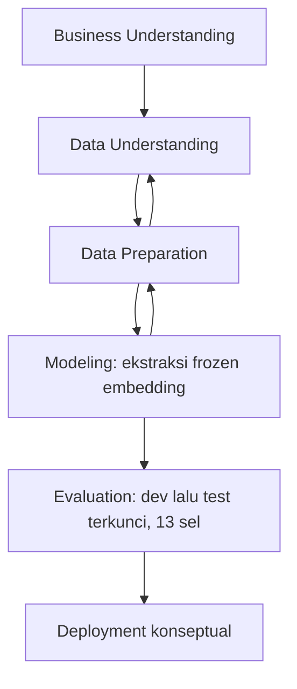
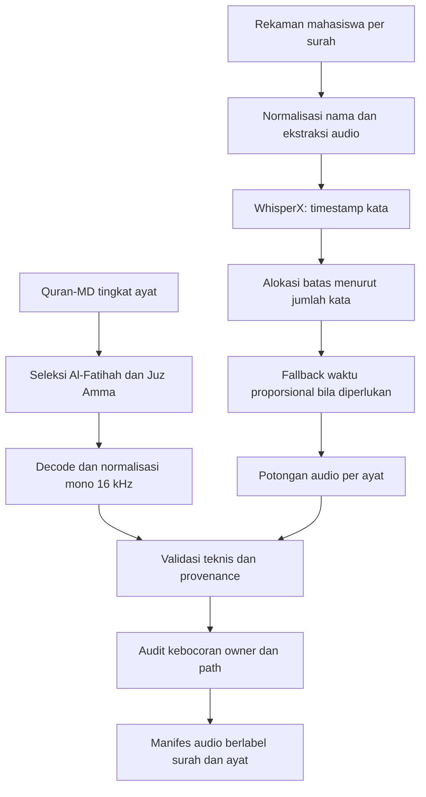
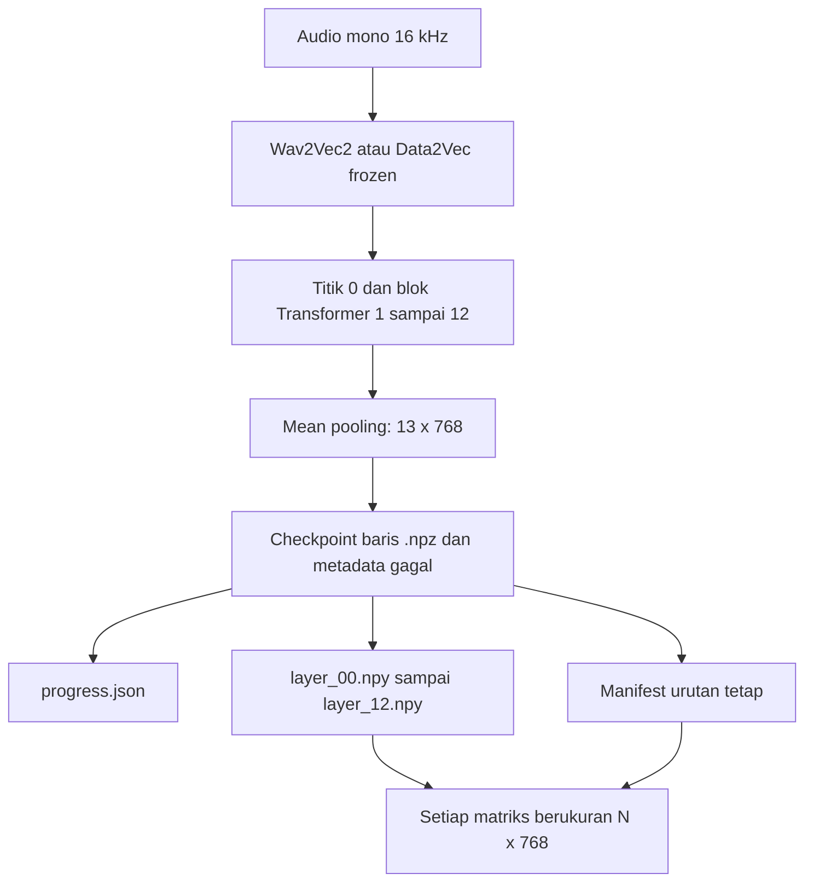
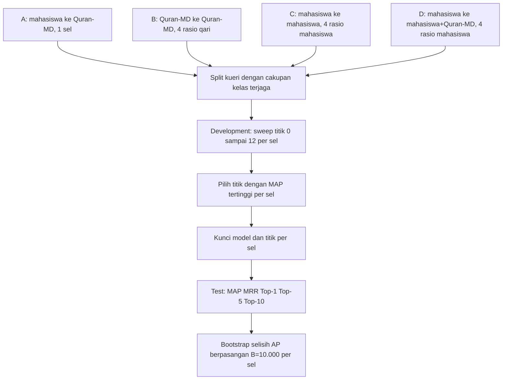
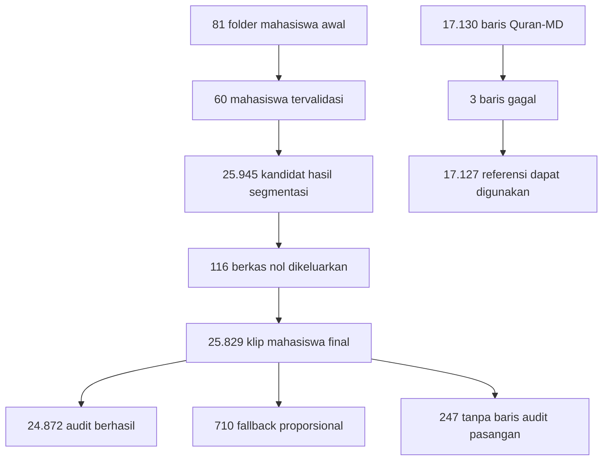
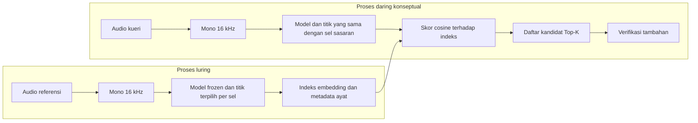

# BAB III METODOLOGI PENELITIAN

Bab ini menjelaskan rancangan penelitian untuk membandingkan representasi laten Wav2Vec2 dan Data2Vec pada tugas *retrieval* audio ayat Al-Qur'an. Penelitian mengikuti enam fase *Cross-Industry Standard Process for Data Mining* (CRISP-DM), yaitu *business understanding*, *data understanding*, *data preparation*, *modeling*, *evaluation*, dan *deployment* [26]. Kerangka tersebut diadaptasi karena penelitian tidak melatih model baru. Fase *modeling* berisi ekstraksi representasi dari model pralatih yang parameternya dibekukan, sedangkan fase *deployment* membahas rancangan penerapan secara konseptual, bukan pengoperasian sistem produksi.

Alur penelitian bersifat iteratif. Temuan mengenai kualitas berkas pada fase pemahaman data dapat mengembalikan proses ke persiapan data, sedangkan pemeriksaan hasil ekstraksi dapat memicu pembersihan dan pembentukan ulang manifes. Meskipun demikian, pemilihan konfigurasi dan pelaporan hasil dipisahkan secara ketat. Titik representasi terbaik dipilih hanya menggunakan himpunan pengembangan, lalu dikunci sebelum evaluasi akhir pada himpunan pengujian.

## 3.1 Business Understanding

Fase *business understanding* menerjemahkan masalah penelitian menjadi tujuan teknis dan ukuran evaluasi yang dapat diuji. Masalah utama penelitian adalah belum diketahuinya kualitas representasi bawaan Wav2Vec2 dan Data2Vec untuk mencocokkan bacaan ayat Al-Qur'an secara langsung dari audio. Kedua model memiliki mekanisme pralatih yang berbeda. Wav2Vec2 menggunakan pembelajaran kontrastif (Baevski et al., 2020), sedangkan Data2Vec menggunakan *self-distillation* dengan target representasi kontekstual (Baevski et al., 2022). Perbedaan tersebut perlu dinilai pada tugas *retrieval*, sebab keberhasilan pada pengenalan ucapan tidak dapat langsung dianggap berlaku pada pemeringkatan audio.

Tujuan operasional penelitian terdiri atas dua bagian. Pertama, membangun alur yang dapat mengubah klip audio menjadi *frozen embedding*, menghitung kemiripan, dan menghasilkan daftar kandidat ayat. Kedua, membandingkan kualitas daftar peringkat Wav2Vec2 dan Data2Vec pada empat kondisi sumber data yang membentuk 13 sel evaluasi. Seluruh parameter model dipertahankan dalam keadaan beku agar hasil mencerminkan kemampuan representasi pralatih, bukan pengaruh *fine-tuning* pada korpus penelitian.

Kriteria keberhasilan implementasi bukan nilai minimum metrik tertentu. Implementasi dinyatakan berhasil apabila setiap embedding dapat dilacak ke klip dan label ayatnya, bentuk matriks konsisten, kegagalan diperlakukan sama pada kedua model, serta peringkat dapat dievaluasi dengan prosedur yang terkunci. Kualitas hasil diukur dengan MAP, MRR, Top-1, Top-5, dan Top-10 (Manning et al., 2008, Ch. 8; Voorhees, 1999). *Cosine similarity* (Dehak et al., 2011) hanya berfungsi sebagai skor untuk menyusun peringkat, bukan sebagai metrik evaluasi akhir.

Gambar 3.1 memperlihatkan adaptasi CRISP-DM yang digunakan. Panah umpan balik menunjukkan bahwa pemeriksaan kualitas dapat mengulang tahap sebelumnya tanpa membuka kembali himpunan pengujian untuk pemilihan konfigurasi.

**Gambar 3.1 Adaptasi CRISP-DM pada penelitian retrieval audio ayat**

Alur tersebut menempatkan validitas data dan keterlacakan sebagai prasyarat evaluasi. Adaptasi paling penting terletak pada fase *modeling*, yang tidak memuat pembaruan bobot, dan fase *deployment*, yang hanya menyusun rancangan penggunaan hasil eksperimen. Dengan demikian, penelitian tetap mengikuti urutan CRISP-DM tanpa menyatakan bahwa prototipe telah menjadi layanan produksi.

## 3.2 Data Understanding

Penelitian menggunakan dua sumber data, yaitu rekaman mahasiswa dan Quran-MD [28]. Rekaman mahasiswa berasal dari pengumpulan tugas Tahfidz. Satu rekaman dapat berisi bacaan satu surah sehingga perlu dibagi menjadi klip per ayat. Quran-MD telah menyediakan audio pada tingkat ayat beserta identitas qari, surah, dan ayat. Ruang lingkup keduanya dibatasi pada Surah Al-Fatihah dan surah dalam Juz Amma.

Peran setiap sumber tidak tetap pada satu sisi. Rekaman mahasiswa menjadi kueri pada skenario lintas domain (A) dan pada skenario lintas mahasiswa (C dan D). Quran-MD menjadi basis data pada skenario A dan D, menjadi kueri dan basis data pada skenario B, serta melengkapi basis data pada skenario D. Skenario D menambahkan seluruh Quran-MD ke basis data mahasiswa yang sudah ada, sehingga menguji kondisi kueri mahasiswa melawan basis data gabungan yang lebih besar. Perubahan peran ini memungkinkan pengaruh perbedaan domain, pembaca, akuisisi, dan segmentasi diamati melalui protokol yang sama.

| Sumber data | Unit awal | Metadata utama | Peran dalam penelitian | Perlakuan khusus |
|---|---|---|---|---|
| Rekaman mahasiswa | Rekaman surah dari folder mahasiswa | Identitas mahasiswa, surah, ayat, berkas sumber | Kueri A; kueri dan basis data C dan D | Normalisasi nama, ekstraksi audio secara netral terhadap format, segmentasi per ayat, audit asal klip |
| Quran-MD [28] | Audio tingkat ayat | Identitas qari, surah, ayat, audio | Basis data A dan D; kueri dan basis data B | Seleksi Al-Fatihah dan Juz Amma, normalisasi audio, validasi baris referensi |

**Tabel 3.1 Peran sumber data dalam rancangan eksperimen**

Pemahaman data dilakukan melalui empat pemeriksaan. Pertama, struktur direktori dan variasi nama dinormalisasi menjadi identitas baku. Kedua, berkas diuji keterbacaannya serta diperiksa ukuran, kanal, laju sampel, dan durasinya. Ketiga, setiap klip dikaitkan dengan identitas pembaca serta pasangan nomor surah dan ayat. Keempat, ketersediaan sedikitnya satu dokumen relevan bagi setiap kueri diperiksa setelah skenario dibentuk.

Pasangan `(surah, ayat)` menjadi definisi relevansi. Dokumen dinyatakan relevan apabila pasangan tersebut sama dengan pasangan pada kueri, tanpa mensyaratkan pembaca yang sama. Transkripsi tidak digunakan pada proses pencarian. Teks ayat hanya membantu penentuan jumlah kata pada tahap segmentasi rekaman mahasiswa.

Validasi yang dilakukan harus dibatasi maknanya secara tepat. Pemeriksaan folder, ukuran berkas, keterbacaan audio, konsistensi metadata, keberadaan catatan audit, dan hubungan klip dengan rekaman sumber merupakan validasi teknis dan validasi *provenance*. Proses tersebut bukan pembuktian manual bahwa seluruh batas ayat akurat secara fonetik. Karena tidak ada anotasi batas waktu manual untuk semua klip, ketepatan batas hasil segmentasi tetap menjadi sumber ketidakpastian data.

## 3.3 Data Preparation

Fase persiapan data mengubah dua sumber yang berbeda menjadi audio tingkat ayat dengan label dan format masukan yang konsisten. Proses dilaksanakan melalui seleksi cakupan, normalisasi identitas, normalisasi audio, segmentasi cabang mahasiswa, validasi teknis, audit kebocoran, dan pembentukan manifes.

Gambar 3.2 merinci dua cabang persiapan. Cabang Quran-MD tidak melalui segmentasi karena unit datanya sudah berupa ayat. Cabang mahasiswa memerlukan stempel waktu kata dan penentuan batas ayat sebelum kedua cabang dipertemukan pada format audio dan skema metadata yang sama.

**Gambar 3.2 Persiapan dua cabang data referensi dan kueri**

Diagram tersebut memperjelas bahwa WhisperX menghasilkan stempel waktu pada tingkat kata, bukan batas ayat final. Batas ayat dibentuk setelahnya dengan mengalokasikan urutan kata menurut jumlah kata per ayat. Jika penyelarasan kata tidak dapat mendukung pembagian tersebut, waktu audio dialokasikan secara proporsional sebagai *fallback*. Seluruh hasil selanjutnya masuk ke pemeriksaan teknis dan keterlacakan yang sama.

### 3.3.1 Seleksi dan normalisasi identitas

Tahap pertama memilih Surah Al-Fatihah dan surah dalam Juz Amma. Variasi penamaan folder serta berkas mahasiswa, seperti kapitalisasi, nomor awal, garis bawah, tanda hubung, dan variasi nama transliterasi, dipetakan ke nomor surah baku. Identitas klip kemudian disusun dari identitas pembaca, nomor surah, nomor ayat, dan lokasi rekaman sumber. Cara ini mencegah dua ejaan nama surah diperlakukan sebagai kelas yang berbeda.

Tahap kedua mengekstrak komponen audio dari media sumber tanpa menetapkan klaim format perantara yang tidak seragam. Audio kemudian dinormalisasi menjadi satu kanal dengan laju sampel 16 kHz. Deskripsi ini sengaja netral terhadap format sumber dan format antara, sebab yang diperlukan model adalah gelombang mono 16 kHz. Hasil segmentasi akhir pada cabang mahasiswa dapat tersimpan sebagai MP3, tetapi format penyimpanan tersebut tidak mengubah spesifikasi gelombang yang diberikan kepada model.

### 3.3.2 Segmentasi rekaman mahasiswa

Segmentasi dijalankan secara bertahap sebagai berikut.

1. Rekaman tingkat surah dipetakan ke nomor surah baku dan komponen audionya dibaca.
2. WhisperX melakukan transkripsi dan penyelarasan untuk memperoleh urutan kata beserta waktu mulai dan selesai pada tingkat kata.
3. Jumlah kata setiap ayat digunakan untuk membagi urutan stempel waktu. Jika ayat pertama berisi sejumlah kata tertentu, sebanyak itulah stempel waktu awal dialokasikan kepada ayat pertama, lalu proses diteruskan ke ayat berikutnya.
4. Batas mulai klip diambil dari awal kata pertama yang dialokasikan, sedangkan batas akhir diambil dari akhir kata terakhir dalam alokasi ayat tersebut.
5. Apabila hasil audit tidak menyediakan penyelarasan kata yang dapat dipakai, durasi rekaman dibagi secara proporsional menurut jumlah kata sebagai mekanisme cadangan.
6. Setiap potongan disimpan bersama identitas rekaman induk, metode segmentasi, surah, dan ayat agar asalnya dapat diaudit.

Pembagian berdasarkan jumlah kata mengasumsikan urutan kata terdeteksi secara memadai. Kesalahan transkripsi, bagian pembuka, jeda panjang, pengulangan, atau kata yang terlewat dapat menggeser batas. Oleh sebab itu, status audit berhasil menunjukkan keberhasilan prosedur teknis, bukan jaminan manual bahwa batas klip tepat pada setiap ayat. Kategori *fallback* juga dipertahankan dalam metadata agar ketidakpastian tidak disembunyikan.

### 3.3.3 Validasi, audit kebocoran, dan pembentukan manifes

Berkas berukuran nol dikeluarkan sebelum ekstraksi model. Berkas yang lolos dicatat dalam manifes dengan urutan tetap. Manifes menyimpan lokasi audio, identitas pembaca, nomor surah, nomor ayat, sumber data, dan informasi *provenance* segmentasi. Hubungan satu banding satu antara baris manifes dan baris embedding menjadi dasar keterlacakan sepanjang eksperimen.

Untuk setiap sel, kueri hanya dipertahankan jika basis data memuat sedikitnya satu dokumen dengan pasangan surah dan ayat yang sama. Pembagian pemilik pada skenario B, C, dan D dibuat saling lepas. Dengan demikian, model tidak memperoleh keuntungan dari kemunculan qari atau mahasiswa yang sama pada sisi kueri dan basis data.

Audit kebocoran memeriksa dua hal. Pertama, tidak ada identitas pemilik yang muncul di kedua sisi kueri dan basis data pada sel yang menggunakan pemisahan pemilik. Kedua, tidak ada jalur berkas yang sama persis antara kueri dan basis data yang dapat menyebabkan kebocoran data (Kapoor dan Narayanan, 2023). Audit matriks akhir dijalankan sebelum skoring/evaluasi pada setiap sel, ketika keanggotaan skenario dan sel dibentuk dari manifes yang tervalidasi, dan hasilnya dicatat per sel.

## 3.4 Modeling

Fase *modeling* menggunakan Wav2Vec2 dan Data2Vec dalam keadaan beku. Tidak ada *fine-tuning*, pembaruan gradien, atau kepala prediksi yang dilatih dengan label ayat. Kedua model menerima gelombang mono 16 kHz dan menghasilkan urutan representasi kontekstual berdimensi 768. Perbedaan mekanisme pralatih tetap dipertahankan, tetapi prosedur masukan, agregasi, penyimpanan, dan pembersihan dibuat setara.

Representasi diambil pada 13 titik. Titik 0 adalah representasi sebelum keluaran blok Transformer pertama, kemudian titik 1 sampai 12 adalah keluaran blok Transformer 1 sampai 12. Dengan kata lain, 13 titik tersebut terdiri atas titik 0 ditambah keluaran dua belas blok Transformer. Untuk setiap titik `l`, keluaran temporal $H_l \in \mathbb{R}^{T_l \times 768}$ diringkas dengan *mean pooling*:

$$
\mathbf{e}_l = \frac{1}{T_l}\sum_{t=1}^{T_l} H_{l,t}, \qquad \mathbf{e}_l \in \mathbb{R}^{768}.
$$

Satu klip menghasilkan 13 vektor berukuran 768. Agregasi rata-rata dipilih agar audio dengan durasi berbeda dapat dibandingkan dalam ruang berdimensi tetap. Pendekatan ini juga memastikan bahwa perbedaan hasil antartitik berasal dari representasi model, bukan dari perbedaan dimensi embedding. Analisis lapisan (Pasad et al., 2021) menunjukkan bahwa representasi pada lapisan berbeda menangkap informasi akustik dan linguistik yang berbeda, sehingga penyapuan seluruh lapisan diperlukan untuk menemukan titik terbaik.

Gambar 3.3 menunjukkan alur ekstraksi dan penyimpanan. Checkpoint per baris diperlukan agar proses berskala besar dapat dilanjutkan tanpa mengulang seluruh korpus serta agar kegagalan tetap tercatat pada posisi asalnya.

**Gambar 3.3 Ekstraksi layerwise, checkpoint, manifes, dan matriks akhir**

Setiap checkpoint sementara `.npz` menyimpan hasil satu baris dengan bentuk `(13, 768)` beserta metadata kegagalan. `progress.json` mencatat kemajuan penyelesaian sehingga proses dapat dilanjutkan secara deterministik. Setelah ekstraksi selesai, checkpoint dirakit menjadi `layer_00.npy` sampai `layer_12.npy`; setiap berkas mempunyai bentuk `(N, 768)`. Baris ke-$i$ pada seluruh matriks selalu merujuk ke baris ke-$i$ pada manifes.

### 3.4.1 Pembersihan hasil ekstraksi

Kegagalan ekstraksi dan nilai bukan bilangan diperiksa sebelum evaluasi. Ekstraktor menolak keluaran yang bentuknya tidak sesuai atau mengandung nilai non-*finite*, lalu menandai baris tersebut sebagai gagal pada manifes. Indeks gagal dari Wav2Vec2 dan Data2Vec digabung melalui *union filtering*. Jika satu baris gagal pada salah satu model, baris yang sama dikeluarkan dari keduanya. Prosedur ini menjamin bahwa selisih metrik tidak disebabkan oleh perbedaan kueri atau kandidat yang dinilai.

Sesudah penyaringan, keselarasan manifes dan matriks diperiksa kembali. Jumlah baris setiap `layer_XX.npy` harus sama dengan jumlah baris manifes, tipe data harus `float32`, dan urutan identitas tidak boleh berubah. Aturan metodologis ini diterapkan sama pada kedua model; jumlah baris yang berhasil dan dikeluarkan dilaporkan pada BAB IV.

### 3.4.2 Skor dan pemeringkatan

Untuk setiap kueri $\mathbf{q}$ dan kandidat basis data $\mathbf{d}_j$ pada titik representasi yang sama, skor dihitung dengan *cosine similarity* (Dehak et al., 2011):

$$
s(\mathbf{q},\mathbf{d}_j)=\frac{\mathbf{q}^{\mathsf{T}}\mathbf{d}_j}{\lVert\mathbf{q}\rVert_2\lVert\mathbf{d}_j\rVert_2}.
$$

Seluruh kandidat diurutkan dari skor terbesar ke terkecil. Hasilnya adalah daftar peringkat, bukan keputusan akhir mengenai benar atau salah. Daftar ini kemudian dinilai terhadap label relevansi `(surah, ayat)`. Pemisahan fungsi tersebut penting: *cosine similarity* menentukan urutan, sedangkan MAP, MRR, dan Top-K mengukur kualitas urutan.

## 3.5 Evaluation

Evaluasi dirancang untuk membandingkan model pada empat skenario yang membentuk 13 sel. Skenario A menggunakan rekaman mahasiswa sebagai kueri dan Quran-MD sebagai basis data, tanpa pemisahan pemilik karena seluruh rekaman mahasiswa menjadi kueri dan seluruh Quran-MD menjadi basis data. Skenario B menggunakan Quran-MD pada kedua sisi dengan qari kueri dan basis data yang saling lepas, diuji pada empat rasio pemilik. Skenario C menggunakan rekaman mahasiswa pada kedua sisi dengan mahasiswa kueri dan basis data yang saling lepas, juga pada empat rasio pemilik. Skenario D menggunakan rekaman mahasiswa sebagai kueri dan gabungan seluruh mahasiswa lain serta seluruh Quran-MD sebagai basis data, pada empat rasio pemilik yang sama dengan C.

Rasio pemilik (*owner_ratio*) menyatakan fraksi pemilik identitas yang ditempatkan di sisi basis data. Rasio 60/40 berarti 60% pemilik berada di basis data dan 40% di sisi kueri. Rasio yang diuji adalah 60/40, 70/30, 80/20, dan 90/10. Skenario A tidak menggunakan rasio pemilik karena tidak ada pemisahan identitas, sehingga hanya menghasilkan satu sel. Total sel evaluasi adalah 1 + 4 + 4 + 4 = 13 sel.

Gambar 3.4 menyajikan hubungan sumber data dan protokol *development/test*. Diagram ini menekankan bahwa penyapuan titik representasi berhenti pada himpunan pengembangan dan dilakukan secara terpisah untuk setiap sel.

**Gambar 3.4 Skenario A, B, C, D serta protokol pemilihan pada development dan pelaporan pada test untuk 13 sel**

### 3.5.1 Pembagian pemilik dan cakupan filter

Seluruh identitas pembaca terlebih dahulu diurutkan, kemudian dipermutasi menggunakan generator bilangan acak dengan *seed* 42. Untuk setiap rasio, sebanyak proporsi yang sesuai dari sisi kueri dipisahkan dari sisi basis data. Pada skenario B dengan 30 qari total, rasio 60/40 menghasilkan 12 qari kueri dan 18 qari basis data; rasio 70/30 menghasilkan 9 qari kueri dan 21 qari basis data; rasio 80/20 menghasilkan 6 qari kueri dan 24 qari basis data; rasio 90/10 menghasilkan 3 qari kueri dan 27 qari basis data. Pada skenario C dan D dengan 60 mahasiswa total, rasio 60/40 menghasilkan 24 mahasiswa kueri dan 36 mahasiswa basis data; rasio 70/30 menghasilkan 18 mahasiswa kueri dan 42 mahasiswa basis data; rasio 80/20 menghasilkan 12 mahasiswa kueri dan 48 mahasiswa basis data; rasio 90/10 menghasilkan 6 mahasiswa kueri dan 54 mahasiswa basis data.

Pada skenario D, basis data merupakan gabungan seluruh klip mahasiswa yang bukan milik kueri dengan seluruh 17.127 klip Quran-MD. Dengan demikian, basis data D lebih besar daripada basis data C pada rasio pemilik yang sama. Kueri pada D identik dengan kueri pada C untuk rasio yang sama.

Setelah pembagian pemilik, kueri tanpa dokumen relevan di basis data dikeluarkan melalui cakupan filter. Sisa kueri kemudian dibagi menjadi *development* dan *test*.

### 3.5.2 Pembagian development dan test

Pembagian *development* dan *test* dilakukan secara terstratifikasi untuk setiap pasangan `(surah, ayat)` menggunakan *seed* 42. Indeks di dalam setiap pasangan diacak, kemudian jumlah data pengembangan ditetapkan dengan $k=\max(1,\lfloor 0{,}7n\rfloor)$, dengan $n$ sebagai jumlah kueri pada pasangan tersebut. Sisa indeks menjadi data pengujian. Karena pembulatan diterapkan per pasangan, jumlah akhir tidak dinyatakan sebagai rasio klip 70/30 yang tepat; hitungan aktual pada BAB IV menjadi acuan reproduksi.

### 3.5.3 Metrik evaluasi

MAP digunakan untuk merangkum presisi pada posisi setiap dokumen relevan di seluruh kueri. MRR berfokus pada kebalikan peringkat dokumen relevan pertama. Top-1, Top-5, dan Top-10 menyatakan proporsi kueri yang memiliki sedikitnya satu dokumen relevan pada batas peringkat terkait. Karena setiap kueri memiliki banyak dokumen relevan, MAP dan MRR menangkap aspek yang berbeda. MAP menilai sebaran dokumen relevan, sedangkan MRR dan Top-K lebih menekankan kemunculan awal.

### 3.5.4 Pemilihan titik representasi

Pemilihan titik dilakukan secara terpisah untuk setiap sel. Untuk setiap sel, MAP dihitung pada himpunan pengembangan untuk titik 0 sampai 12. Titik dengan MAP tertinggi dipilih secara terpisah bagi setiap model. Setelah titik dipilih, himpunan pengujian dibuka untuk satu evaluasi akhir. Tidak ada pemilihan ulang berdasarkan hasil pengujian.

### 3.5.5 Uji signifikansi bootstrap

Perbedaan statistik dihitung dari AP per kueri yang berpasangan (Smucker et al., 2007). Untuk setiap sel, selisih didefinisikan sebagai AP Data2Vec dikurangi AP Wav2Vec2, kemudian diambil rata-ratanya. Dengan *seed* 42, satu replikasi *bootstrap* (Efron, 1979) mengambil ulang indeks kueri berpasangan sebanyak jumlah kueri dengan pengembalian, lalu menghitung rerata selisih AP pada indeks tersebut. Proses diulang sebanyak B = 10.000 kali. Batas interval kepercayaan 95% ditentukan melalui persentil 2,5 dan 97,5 dari distribusi rerata selisih. Interval yang tidak mencakup nol menunjukkan dukungan statistik terhadap perbedaan MAP.

Uji ini hanya berlaku untuk selisih MAP atau AP yang dibentuk dari kueri berpasangan. Penelitian tidak melakukan uji inferensial untuk MRR, Top-1, Top-5, atau Top-10. Perbedaan pada metrik tersebut hanya boleh dibahas secara deskriptif.

### 3.5.6 Baseline acak dan lift

Untuk setiap sel, baseline acak analitik dihitung sebagai `random_baseline = rerata jumlah dokumen relevan per kueri / ukuran basis data`. Lift MAP didefinisikan sebagai `lift_map = MAP / random_baseline`, sehingga bernilai kelipatan (*kali*), bukan persentase. Sebagai contoh, lift 7,78 berarti MAP model bernilai 7,78 kali baseline acak. Lift mengukur seberapa jauh kinerja model melampaui tebakan acak. Perbandingan lift antarsel perlu dibaca dengan hati-hati karena baseline dan komposisi pengujian berbeda.

### 3.5.7 Peringatan perbandingan lintas sel

Kepadatan dokumen relevan dan ukuran basis data berbeda antarsel dan antarskenario. Oleh sebab itu, nilai MAP antarsel tidak ditafsirkan sebagai perbandingan terkontrol yang berdiri sendiri. Perbandingan utama tetap dilakukan antara Wav2Vec2 dan Data2Vec di dalam sel yang sama, sedangkan perbedaan antarsel digunakan sebagai analisis diagnostik terhadap perubahan domain dan karakteristik data. Rerata makro antarsel memperlakukan setiap sel setara walaupun jumlah data uji berbeda, sehingga bukan estimasi performa per-kueri gabungan.

## 3.6 Deployment

Fase *deployment* merumuskan cara hasil penelitian dapat ditempatkan dalam alur pencarian audio. Tahap ini bersifat konseptual. Penelitian tidak menguji layanan produksi, waktu respons pengguna, keamanan API, kapasitas serentak, pemantauan, atau pemeliharaan indeks.

Secara konseptual, proses luring menyiapkan embedding basis data satu kali dengan model dan titik representasi terpilih. Proses daring menormalisasi audio kueri, mengekstrak embedding dengan konfigurasi yang sama, menghitung skor kosinus terhadap indeks, lalu mengembalikan kandidat berperingkat tertinggi. Konfigurasi harus dipilih menurut sel sasaran dan metrik prioritas, bukan berdasarkan anggapan bahwa satu model unggul pada semua kondisi. Literatur yang ada tidak menetapkan pemenang universal untuk korpus Al-Qur'an; pemilihan model tetap bergantung pada evaluasi pengembangan pada data sasaran.

Kelayakan konseptual dinilai dari tiga syarat. Pertama, konfigurasi model dan titik representasi harus dikunci dari bukti pengembangan yang relevan untuk sel sasaran. Kedua, basis data harus memakai normalisasi, model, dan dimensi yang sama dengan kueri. Ketiga, hasil peringkat perlu diperlakukan sebagai kandidat, terutama pada sel dengan akurasi rendah. Rancangan lengkap dan implikasi hasilnya dibahas kembali pada Bagian 4.6.

# BAB IV HASIL DAN PEMBAHASAN

Bab ini menyajikan hasil rekonsiliasi korpus, ekstraksi representasi, pemilihan titik, evaluasi akhir, dan perbandingan statistik pada 13 sel. Semua angka kinerja berasal dari protokol final dengan pemilihan konfigurasi pada himpunan pengembangan dan pelaporan pada himpunan pengujian yang terkunci.

## 4.1 Hasil Business Understanding

Fase *business understanding* menghasilkan definisi keberhasilan yang berfokus pada validitas eksperimen dan kemampuan menjawab pertanyaan penelitian. Alur Wav2Vec2 dan Data2Vec berhasil diimplementasikan untuk menghasilkan embedding per titik, membentuk peringkat berdasarkan skor kosinus, serta mengukur peringkat dengan metrik *retrieval* pada 13 sel. Keberhasilan ini tidak berarti sistem telah memenuhi ambang operasional tertentu, sebab penelitian tidak menetapkan MAP atau Top-K minimum.

Perbandingan dirancang adil melalui empat pengendalian. Pertama, kedua model menerima baris audio yang identik setelah *union filtering*. Kedua, dimensi embedding dan metode *mean pooling* dibuat sama. Ketiga, relevansi ditentukan oleh label surah dan ayat yang sama. Keempat, titik terbaik dipilih pada *development set* per sel dan hasil akhir hanya dihitung pada *test set* yang tidak dipakai dalam pemilihan.

Tiga belas sel memberi konteks terhadap angka kinerja. Skenario A mewakili penggunaan lintas domain yang paling dekat dengan pencarian bacaan mahasiswa terhadap Quran-MD. Skenario B mengurangi perbedaan sumber akuisisi karena kedua sisi berasal dari Quran-MD, tetapi tetap memisahkan qari pada empat rasio. Skenario C mempertahankan karakteristik rekaman dan segmentasi mahasiswa pada kedua sisi sambil memisahkan identitas mahasiswa pada empat rasio. Skenario D menguji kueri mahasiswa melawan basis data gabungan yang lebih besar, yaitu mahasiswa lain dan seluruh Quran-MD, pada empat rasio. Susunan ini memungkinkan pembahasan beralih dari pertanyaan "model mana yang paling baik" menuju pertanyaan yang lebih tepat, yaitu "model mana yang lebih baik pada sel dan metrik tertentu".

## 4.2 Hasil Data Understanding

Rekonsiliasi data membedakan jumlah pada tahap pengumpulan, segmentasi, validasi, dan ekstraksi. Pemisahan ini mencegah angka dari tahap yang berbeda disajikan seolah-olah merujuk pada populasi yang sama.

Gambar 4.1 merangkum perubahan korpus mahasiswa dan Quran-MD sampai siap dipakai. Diagram juga menampilkan tiga kategori *provenance* klip mahasiswa yang jumlahnya tepat sama dengan total kueri final.

**Gambar 4.1 Rekonsiliasi korpus dan provenance data final**

Alur tersebut menunjukkan bahwa 81 adalah jumlah folder mahasiswa pada pengumpulan awal, sedangkan 60 adalah mahasiswa yang lolos validasi teknis untuk eksperimen. Sebanyak 116 berkas nol dikeluarkan sebelum ekstraksi, bukan dihitung sebagai kegagalan model. Pada Quran-MD, tiga kegagalan terjadi saat pemrosesan 17.130 baris referensi dan dikeluarkan secara identik dari kedua model.

| Tahap atau kategori | Jumlah | Status dan penjelasan |
|---|---:|---|
| Folder mahasiswa awal | 81 | Populasi folder pada awal pengumpulan |
| Mahasiswa tervalidasi | 60 | Memenuhi pemeriksaan teknis dan struktur data |
| Kandidat hasil segmentasi | 25.945 | Seluruh berkas kandidat sebelum pemeriksaan ukuran |
| Berkas nol byte | 116 | Dikeluarkan sebelum ekstraksi embedding |
| Klip mahasiswa final | 25.829 | Seluruhnya berhasil diekstraksi oleh kedua model |
| *Provenance* audit berhasil | 24.872 | Berasal dari rekaman dengan catatan audit berhasil |
| *Provenance fallback* proporsional | 710 | Hasil alokasi waktu proporsional |
| Tanpa baris audit pasangan | 247 | Tetap terlacak pada manifes, tetapi tidak memiliki pasangan baris audit |
| Baris referensi Quran-MD awal | 17.130 | Kandidat ekstraksi referensi |
| Baris referensi gagal | 3 | Dikeluarkan dengan *union filtering* |
| Referensi Quran-MD dapat digunakan | 17.127 | Baris final yang identik untuk kedua model |

**Tabel 4.1 Rekonsiliasi validasi korpus final**

Jumlah kategori *provenance* mahasiswa konsisten karena $24.872 + 710 + 247 = 25.829$. Kategori tersebut tidak boleh ditafsirkan sebagai penilaian manual mutu batas ayat. Label audit menjelaskan jalur proses dan ketersediaan catatan, sedangkan ketepatan fonetik batas masih memerlukan anotasi manual yang tidak tersedia dalam penelitian ini.

## 4.3 Hasil Data Preparation

Persiapan data menghasilkan gelombang masukan mono 16 kHz, identitas ayat yang seragam, manifes berurutan, dan kelompok kueri yang menjaga cakupan kelas sesuai protokol final. Format sumber tidak dipaksakan menjadi satu klaim konversi khusus. Rekaman media dibaca dan dinormalisasi secara netral terhadap format, sedangkan potongan hasil segmentasi mahasiswa dapat berupa MP3.

WhisperX menghasilkan stempel waktu kata. Batas ayat tidak diberikan langsung oleh WhisperX, tetapi dihitung melalui alokasi urutan kata berdasarkan jumlah kata per ayat. Ketika jalur tersebut tidak tersedia atau tidak dapat dipakai, sistem menggunakan pembagian waktu proporsional. Hasil akhirnya dapat diproses secara otomatis dalam skala besar, tetapi validasinya tetap bersifat teknis dan *provenance*. Tidak dilakukan pemeriksaan manual menyeluruh yang membuktikan ketepatan setiap batas.

Audit kebocoran pada seluruh sel B, C, dan D memastikan tidak ada identitas pemilik yang muncul di kedua sisi dan tidak ada jalur berkas yang sama antara kueri dan basis data. Seluruh audit lolos tanpa temuan kebocoran.

### 4.3.1 Matriks ukuran 13 sel

Tabel 4.2 menyajikan ukuran kueri dan basis data untuk setiap sel. Angka pada sisi kueri dan basis data adalah ukuran yang benar-benar digunakan untuk membentuk peringkat setelah cakupan filter.

| Sel | Sumber kueri | Jumlah kueri | Sumber basis data | Jumlah basis data | Pemisahan pemilik |
|---|---|---:|---|---:|---|
| A | Mahasiswa | 25.829 | Quran-MD | 17.127 | Lintas sumber data |
| B-60:40 | Quran-MD | 6.849 | Quran-MD | 10.278 | 12 qari berbanding 18 qari |
| B-70:30 | Quran-MD | 5.139 | Quran-MD | 11.988 | 9 qari berbanding 21 qari |
| B-80:20 | Quran-MD | 3.426 | Quran-MD | 13.701 | 6 qari berbanding 24 qari |
| B-90:10 | Quran-MD | 1.713 | Quran-MD | 15.414 | 3 qari berbanding 27 qari |
| C-60:40 | Mahasiswa | 9.386 | Mahasiswa | 16.443 | 24 mahasiswa berbanding 36 mahasiswa |
| C-70:30 | Mahasiswa | 6.995 | Mahasiswa | 18.834 | 18 mahasiswa berbanding 42 mahasiswa |
| C-80:20 | Mahasiswa | 4.118 | Mahasiswa | 21.711 | 12 mahasiswa berbanding 48 mahasiswa |
| C-90:10 | Mahasiswa | 1.833 | Mahasiswa | 23.996 | 6 mahasiswa berbanding 54 mahasiswa |
| D-60:40 | Mahasiswa | 9.386 | Mahasiswa + Quran-MD | 33.570 | 24 mahasiswa berbanding 36 mahasiswa + seluruh Quran-MD |
| D-70:30 | Mahasiswa | 6.995 | Mahasiswa + Quran-MD | 35.961 | 18 mahasiswa berbanding 42 mahasiswa + seluruh Quran-MD |
| D-80:20 | Mahasiswa | 4.118 | Mahasiswa + Quran-MD | 38.838 | 12 mahasiswa berbanding 48 mahasiswa + seluruh Quran-MD |
| D-90:10 | Mahasiswa | 1.833 | Mahasiswa + Quran-MD | 41.123 | 6 mahasiswa berbanding 54 mahasiswa + seluruh Quran-MD |

**Tabel 4.2 Matriks ukuran kueri dan basis data pada 13 sel**

Seluruh kueri pada setiap sel memiliki sedikitnya satu dokumen relevan, sehingga AP nol tidak muncul hanya karena kelas relevan tidak tersedia. Basis data D selalu lebih besar daripada basis data C pada rasio yang sama karena D menambahkan seluruh 17.127 klip Quran-MD.

## 4.4 Hasil Modeling

Ekstraksi final menghasilkan 13 matriks per model dan per himpunan data. Setiap klip mula-mula menghasilkan checkpoint `(13, 768)`, lalu baris dengan titik yang sama dirakit ke `layer_00.npy` sampai `layer_12.npy`. Setiap matriks akhir berbentuk `(N, 768)`, dan baris ke-$i$ selalu sejalan dengan baris ke-$i$ pada manifes. `progress.json` mencatat kemajuan pemrosesan, sedangkan metadata kegagalan menjaga alasan eksklusi tetap dapat ditelusuri.

Seluruh 25.829 klip mahasiswa berhasil diproses oleh Wav2Vec2 dan Data2Vec. Dengan demikian, ekstraksi kueri final tidak memiliki baris yang ditandai gagal. Pada Quran-MD, tiga dari 17.130 baris ditandai gagal. *Union filtering* mengeluarkan ketiga indeks tersebut dari hasil kedua model dan menyisakan 17.127 baris identik. Keluaran non-*finite* telah ditolak oleh ekstraktor, sedangkan validasi artefak akhir memastikan keberadaan 13 matriks, bentuk `(N, 768)`, tipe `float32`, dan keselarasan jumlah baris dengan manifes.

### 4.4.1 Pemilihan titik representasi per sel

Penyapuan pada *development set* menunjukkan bahwa titik tengah memberi MAP terbaik pada sebagian besar sel. Tabel 4.3 merangkum titik yang dipilih sebelum pengujian akhir untuk setiap sel dan model.

| Sel | n_dev | n_test | Titik Wav2Vec2 | Titik Data2Vec |
|---|---:|---:|---:|---:|
| A | 17.839 | 7.990 | 7 | 5 |
| B-60:40 | 4.565 | 2.284 | 7 | 6 |
| B-70:30 | 3.426 | 1.713 | 7 | 6 |
| B-80:20 | 2.284 | 1.142 | 7 | 6 |
| B-90:10 | 1.142 | 571 | 8 | 6 |
| C-60:40 | 6.357 | 3.029 | 7 | 6 |
| C-70:30 | 4.613 | 2.382 | 7 | 6 |
| C-80:20 | 2.616 | 1.502 | 7 | 6 |
| C-90:10 | 1.062 | 771 | 7 | 6 |
| D-60:40 | 6.357 | 3.029 | 7 | 5 |
| D-70:30 | 4.613 | 2.382 | 7 | 5 |
| D-80:20 | 2.616 | 1.502 | 7 | 6 |
| D-90:10 | 1.062 | 771 | 7 | 6 |

**Tabel 4.3 Pembagian development, test, dan titik representasi terpilih per sel**

Jumlah *development* dan *test* tepat menjumlah ke total kueri pada setiap sel. Data pengembangan digunakan untuk penyapuan 13 titik, sedangkan data pengujian tetap terkunci sampai titik terbaik ditetapkan. Karena itu, metrik akhir tidak menjadi dasar pemilihan konfigurasi.

Wav2Vec2 konsisten memilih titik 7 pada 12 dari 13 sel, kecuali B-90:10 yang memilih titik 8. Data2Vec memilih titik 5 pada A, D-60:40, dan D-70:30; titik 6 pada seluruh sel B dan C serta D-80:20 dan D-90:10. Hasil ini menunjukkan bahwa keluaran terakhir Transformer bukan pilihan terbaik untuk tugas ini. Representasi tengah tampak memberi keseimbangan yang lebih sesuai antara informasi akustik lokal dan konteks yang telah diolah model. Pernyataan tersebut merupakan interpretasi hasil *layerwise*, bukan bukti kausal mengenai isi setiap lapisan.

## 4.5 Hasil Evaluation dan Pembahasan

Tabel 4.4a sampai 4.4e menyajikan hasil final pada *test set* untuk seluruh 13 sel, dipecah menjadi lima tabel agar lebih mudah dibaca. Tabel 4.4a memuat skenario A, sedangkan Tabel 4.4b sampai 4.4e masing-masing mengelompokkan sel B, C, dan D berdasarkan rasio pemilik basis data (60:40, 70:30, 80:20, dan 90:10). Seluruh nilai dinyatakan dalam persen. Setiap baris memakai titik yang telah dipilih pada *development set* sel yang bersangkutan, sehingga tidak ada pencarian titik tambahan pada data pengujian.

**Tabel 4.4a Hasil evaluasi skenario A (2 baris)**

| Sel | Model | Titik | MAP | MRR | Top-1 | Top-5 | Top-10 |
|---|---|---:|---:|---:|---:|---:|---:|
| A | Wav2Vec2 | 7 | 1,36% | 8,92% | 5,26% | 11,34% | 15,81% |
| A | Data2Vec | 5 | 1,61% | 9,01% | 5,37% | 11,66% | 15,87% |

Skenario A merupakan kondisi lintas sumber, sehingga ditampilkan terpisah dari skenario B, C, dan D yang memiliki variasi rasio pemilik.

**Tabel 4.4b Hasil evaluasi rasio pemilik 60:40 pada skenario B, C, dan D (6 baris)**

| Sel | Model | Titik | MAP | MRR | Top-1 | Top-5 | Top-10 |
|---|---|---:|---:|---:|---:|---:|---:|
| B-60:40 | Wav2Vec2 | 7 | 13,78% | 61,53% | 52,67% | 72,42% | 78,28% |
| B-60:40 | Data2Vec | 6 | 11,42% | 55,13% | 45,36% | 66,86% | 73,86% |
| C-60:40 | Wav2Vec2 | 7 | 3,39% | 27,24% | 19,91% | 34,50% | 41,43% |
| C-60:40 | Data2Vec | 6 | 3,46% | 25,59% | 18,39% | 32,65% | 39,15% |
| D-60:40 | Wav2Vec2 | 7 | 2,03% | 27,21% | 19,81% | 34,47% | 41,73% |
| D-60:40 | Data2Vec | 5 | 2,18% | 26,09% | 18,72% | 33,28% | 40,28% |

**Tabel 4.4c Hasil evaluasi rasio pemilik 70:30 pada skenario B, C, dan D (6 baris)**

| Sel | Model | Titik | MAP | MRR | Top-1 | Top-5 | Top-10 |
|---|---|---:|---:|---:|---:|---:|---:|
| B-70:30 | Wav2Vec2 | 7 | 12,59% | 58,74% | 49,56% | 69,12% | 75,66% |
| B-70:30 | Data2Vec | 6 | 10,45% | 53,43% | 44,54% | 63,16% | 70,05% |
| C-70:30 | Wav2Vec2 | 7 | 3,35% | 28,66% | 21,16% | 36,40% | 43,03% |
| C-70:30 | Data2Vec | 6 | 3,54% | 27,83% | 20,03% | 35,64% | 43,62% |
| D-70:30 | Wav2Vec2 | 7 | 2,08% | 28,77% | 21,33% | 35,98% | 43,16% |
| D-70:30 | Data2Vec | 5 | 2,24% | 26,63% | 18,93% | 33,59% | 41,65% |

**Tabel 4.4d Hasil evaluasi rasio pemilik 80:20 pada skenario B, C, dan D (6 baris)**

| Sel | Model | Titik | MAP | MRR | Top-1 | Top-5 | Top-10 |
|---|---|---:|---:|---:|---:|---:|---:|
| B-80:20 | Wav2Vec2 | 7 | 11,36% | 56,76% | 48,07% | 67,08% | 72,42% |
| B-80:20 | Data2Vec | 6 | 9,45% | 53,50% | 44,75% | 63,49% | 69,18% |
| C-80:20 | Wav2Vec2 | 7 | 3,53% | 31,71% | 23,97% | 39,75% | 47,40% |
| C-80:20 | Data2Vec | 6 | 3,70% | 29,49% | 21,97% | 38,08% | 44,27% |
| D-80:20 | Wav2Vec2 | 7 | 2,25% | 32,03% | 24,23% | 40,15% | 47,07% |
| D-80:20 | Data2Vec | 6 | 2,38% | 29,39% | 21,90% | 37,08% | 43,81% |

**Tabel 4.4e Hasil evaluasi rasio pemilik 90:10 pada skenario B, C, dan D (6 baris)**

| Sel | Model | Titik | MAP | MRR | Top-1 | Top-5 | Top-10 |
|---|---|---:|---:|---:|---:|---:|---:|
| B-90:10 | Wav2Vec2 | 8 | 9,75% | 52,92% | 46,41% | 60,95% | 63,57% |
| B-90:10 | Data2Vec | 6 | 8,45% | 48,84% | 41,33% | 58,32% | 62,00% |
| C-90:10 | Wav2Vec2 | 7 | 3,16% | 28,25% | 19,46% | 36,32% | 45,53% |
| C-90:10 | Data2Vec | 6 | 3,57% | 29,15% | 20,36% | 38,91% | 45,91% |
| D-90:10 | Wav2Vec2 | 7 | 2,16% | 28,40% | 19,71% | 36,58% | 44,88% |
| D-90:10 | Data2Vec | 6 | 2,41% | 28,67% | 20,23% | 38,13% | 46,30% |

### 4.5.1 Pembahasan per skenario

**Skenario A.** Data2Vec menghasilkan MAP 1,61% dibandingkan 1,36% pada Wav2Vec2. Arah metrik lain berbeda. Wav2Vec2 memperoleh MRR 8,92%, Top-1 5,26%, Top-5 11,34%, dan Top-10 15,81%, yang semuanya lebih rendah daripada Data2Vec pada MAP namun sedikit lebih rendah pula pada MRR dan Top-K. Data2Vec unggul pada seluruh metrik di sel A. Skenario A merupakan kondisi lintas sumber yang sulit, dengan MAP absolut yang rendah pada kedua model. Skenario D juga memiliki MAP absolut yang rendah, tetapi diduga karena alasan yang berbeda, yaitu ukuran basis data gabungan yang lebih besar akibat penambahan seluruh Quran-MD; dugaan tersebut merupakan asosiasi yang masuk akal, bukan bukti kausal. Kueri berasal dari rekaman mahasiswa yang melalui proses akuisisi dan segmentasi tersendiri, sedangkan basis data berasal dari Quran-MD. Perbedaan pembaca, perangkat, lingkungan, kualitas rekaman, dan batas segmentasi dapat memengaruhi geometri embedding.

**Skenario B.** Wav2Vec2 unggul pada seluruh sel B dan seluruh metrik. Pada B-60:40, MAP Wav2Vec2 mencapai 13,78% dibandingkan 11,42% untuk Data2Vec. Pola ini konsisten pada B-70:30 (12,59% berbanding 10,45%), B-80:20 (11,36% berbanding 9,45%), dan B-90:10 (9,75% berbanding 8,45%). Wav2Vec2 juga unggul pada MRR, Top-1, Top-5, dan Top-10 di keempat sel B. Walaupun identitas qari dipisahkan, kedua sisi berasal dari Quran-MD. Kesamaan jalur data dan unit ayat mengurangi ketidakcocokan domain yang terdapat pada A. Penurunan MAP seiring meningkatnya rasio basis data (dari 13,78% pada 60:40 ke 9,75% pada 90:10 untuk Wav2Vec2) mencerminkan tantangan basis data yang lebih besar dan jumlah kueri yang lebih sedikit.

**Skenario C.** Data2Vec memiliki MAP lebih tinggi pada keempat rasio C, yaitu 3,46% berbanding 3,39% pada 60:40; 3,54% berbanding 3,35% pada 70:30; 3,70% berbanding 3,53% pada 80:20; dan 3,57% berbanding 3,16% pada 90:10. Namun, keunggulan numerik ini tidak selalu didukung signifikansi statistik. Hanya C-70:30 dan C-90:10 yang menunjukkan perbedaan signifikan, sedangkan C-60:40 dan C-80:20 tidak. Pada metrik lain, Wav2Vec2 cenderung lebih tinggi pada MRR dan Top-K di beberapa sel C, menunjukkan bahwa Data2Vec mengumpulkan presisi di seluruh posisi dokumen relevan, sedangkan Wav2Vec2 lebih sering membawa dokumen relevan pertama ke bagian awal daftar. Kesamaan sumber rekaman mahasiswa pada kedua sisi tampak membantu dibandingkan kondisi lintas sumber A, tetapi variasi akuisisi dan ketidakpastian segmentasi tetap ada.

**Skenario D.** Data2Vec memiliki MAP lebih tinggi pada keempat sel D, yaitu 2,18% berbanding 2,03% pada 60:40; 2,24% berbanding 2,08% pada 70:30; 2,38% berbanding 2,25% pada 80:20; dan 2,41% berbanding 2,16% pada 90:10. Seluruh sel D ditandai signifikan. Namun, nilai absolut D lebih rendah daripada B dan sebanding dengan C. Basis data D yang lebih besar karena penambahan Quran-MD berasosiasi dengan tantangan retrieval yang lebih besar, tetapi hubungan tersebut merupakan asosiasi yang masuk akal, bukan bukti kausal; kueri tetap berasal dari mahasiswa yang sama dengan C. Wav2Vec2 cenderung lebih tinggi pada MRR dan Top-K di beberapa sel D, mirip dengan pola pada C.

**Tidak ada pemenang universal.** Data2Vec memiliki MAP numerik lebih tinggi pada 9 dari 13 sel (A, keempat C, keempat D). Wav2Vec2 memiliki MAP numerik lebih tinggi pada 4 sel (keempat B). Namun, dua sel C (C-60:40 dan C-80:20) tidak menunjukkan perbedaan signifikan. Pola ini menunjukkan bahwa keunggulan model bergantung pada kondisi evaluasi yang didefinisikan oleh skenario dan rasio pemilik, bukan pada arsitektur secara universal. Literatur yang ada tentang model audio pralatih tidak menetapkan pemenang untuk korpus Al-Qur'an; temuan ini konsisten dengan pandangan bahwa performa *layerwise* bergantung pada tugas dan domain (Pasad et al., 2021; Yang et al., 2021).

### 4.5.2 Perbandingan bootstrap per sel

Uji *bootstrap* memakai selisih AP Data2Vec dikurangi Wav2Vec2 per kueri berpasangan. Tabel 4.5 menyajikan selisih rata-rata dalam poin persentase, interval kepercayaan 95%, jumlah kemenangan AP per kueri, dan signifikansi untuk setiap sel. Jumlah kemenangan tidak menentukan signifikansi secara mandiri, sebab besarnya selisih AP pada setiap kueri juga memengaruhi rata-rata dan interval.

| Sel | Selisih MAP (pp) | IK 95% | Menang D2V | Menang W2V2 | Signifikan? | Kesimpulan |
|---|---:|---|---:|---:|---|---|
| A | +0,24 | [+0,18; +0,31] | 3.847 | 4.143 | Ya | Data2Vec lebih tinggi |
| B-60:40 | -2,36 | [-2,76; -1,96] | 1.412 | 872 | Ya | Wav2Vec2 lebih tinggi |
| B-70:30 | -2,14 | [-2,56; -1,73] | 1.073 | 640 | Ya | Wav2Vec2 lebih tinggi |
| B-80:20 | -1,91 | [-2,39; -1,42] | 682 | 460 | Ya | Wav2Vec2 lebih tinggi |
| B-90:10 | -1,30 | [-1,96; -0,65] | 320 | 251 | Ya | Wav2Vec2 lebih tinggi |
| C-60:40 | +0,07 | [-0,06; +0,21] | 1.583 | 1.446 | Tidak | Belum dapat dibedakan |
| C-70:30 | +0,18 | [+0,03; +0,34] | 1.180 | 1.202 | Ya | Data2Vec lebih tinggi |
| C-80:20 | +0,17 | [-0,01; +0,36] | 750 | 752 | Tidak | Belum dapat dibedakan |
| C-90:10 | +0,41 | [+0,10; +0,72] | 369 | 402 | Ya | Data2Vec lebih tinggi |
| D-60:40 | +0,15 | [+0,06; +0,23] | 1.523 | 1.506 | Ya | Data2Vec lebih tinggi |
| D-70:30 | +0,16 | [+0,06; +0,25] | 1.224 | 1.158 | Ya | Data2Vec lebih tinggi |
| D-80:20 | +0,12 | [+0,002; +0,24] | 746 | 756 | Ya | Data2Vec lebih tinggi |
| D-90:10 | +0,26 | [+0,06; +0,46] | 371 | 400 | Ya | Data2Vec lebih tinggi |

**Tabel 4.5 Perbandingan bootstrap selisih MAP per sel (B = 10.000, seed 42)**

Pola signifikansi menunjukkan 11 dari 13 sel memiliki interval kepercayaan yang tidak mencakup nol. Dua sel yang tidak signifikan adalah C-60:40 dan C-80:20. Pada C-60:40, interval [-0,06; +0,21] mencakup nol meskipun arah selisih positif. Pada C-80:20, interval [-0,01; +0,36] juga mencakup nol dengan batas bawah yang sangat dekat nol. Kedua sel ini memiliki selisih MAP numerik kecil (0,07 dan 0,17 poin persentase) yang tidak cukup kuat untuk membedakan model secara statistik.

Makna statistik tersebut terbatas secara tegas pada selisih MAP yang dibentuk dari AP per kueri berpasangan. Penelitian tidak melakukan uji inferensial untuk MRR, Top-1, Top-5, atau Top-10. Perbedaan pada metrik tersebut hanya boleh dibahas secara deskriptif. Signifikansi juga tidak sama dengan kepentingan praktis, terutama pada A dan D yang memiliki selisih MAP kecil dan kinerja absolut rendah.

### 4.5.3 Baseline acak dan lift

Setiap sel memiliki baseline acak analitik yang berbeda karena jumlah dokumen relevan per kueri dan ukuran basis data yang berbeda. Lift MAP terhadap baseline acak menunjukkan bahwa kedua model melampaui tebakan acak pada seluruh 13 sel. Lift tertinggi terdapat pada B-60:40 (Wav2Vec2: 78,70 kali, Data2Vec: 65,22 kali), sedangkan lift terendah terdapat pada A (Wav2Vec2: 7,78 kali, Data2Vec: 9,18 kali). Perbandingan lift lintas sel perlu dibaca dengan hati-hati karena baseline dan komposisi pengujian dapat berbeda.

### 4.5.4 Keterbatasan analisis kualitatif

Analisis kualitatif yang sah membutuhkan daftar peringkat aktual, lokasi audio, label kueri, skor kandidat, dan hasil dengar yang dapat diverifikasi. Artefak hasil agregat yang digunakan dalam bab ini tidak menyediakan contoh daftar peringkat individual yang cukup untuk menuliskan studi kasus. Karena itu, penelitian tidak mengarang contoh keberhasilan atau kegagalan.

| Elemen kasus yang harus diisi | Bukti yang diperlukan | Pertanyaan analisis | Status dalam naskah ini |
|---|---|---|---|
| Identitas kueri | ID manifes, pembaca, surah, ayat, sumber audio | Apakah label dan asal kueri benar? | Memerlukan contoh daftar peringkat aktual |
| Kualitas segmentasi | Audio sumber, batas mulai dan akhir, metode segmentasi | Apakah klip memuat satu ayat secara memadai? | Memerlukan pemeriksaan audio aktual |
| Kandidat peringkat atas | ID, label, skor, posisi untuk kedua model | Ayat apa yang diambil dan apakah relevan? | Memerlukan keluaran per kueri |
| Perbandingan model | Dua daftar peringkat pada kueri yang sama | Di posisi mana perilaku model berbeda? | Memerlukan pasangan daftar aktual |
| Kemiripan fonetik | Audio kueri dan kandidat yang didengarkan | Apakah kesalahan memiliki pola bunyi yang dapat dijelaskan? | Memerlukan penilaian manusia terdokumentasi |
| Kesimpulan kasus | Bukti di atas dan aturan pemilihan kasus | Apakah temuan mewakili pola atau hanya contoh? | Belum dapat disimpulkan |

**Tabel 4.6 Templat analisis kualitatif yang memerlukan contoh ranked list aktual**

Templat tersebut dapat dipakai pada penelitian lanjutan atau lampiran audit setelah artefak per kueri tersedia. Kasus sebaiknya dipilih dengan aturan yang dinyatakan sebelumnya, misalnya perbedaan AP terbesar, keberhasilan bersama, dan kegagalan bersama. Audio kemudian diperiksa tanpa mengubah label atau konfigurasi berdasarkan hasil dengar. Sampai proses itu dilakukan, pembahasan kualitatif harus dinyatakan belum tersedia.

## 4.6 Deployment Konseptual

Hasil eksperimen mendukung rancangan *retrieval* sebagai proses dua tahap, yaitu penyiapan indeks secara luring dan pencarian secara daring. Rancangan ini belum diimplementasikan atau diuji sebagai sistem produksi. Gambar 4.4 menampilkan batas tersebut secara eksplisit.

**Gambar 4.4 Rancangan konseptual deployment retrieval luring dan daring**

Pada proses luring, audio referensi dinormalisasi dan diekstraksi sekali menggunakan model serta titik yang dipilih untuk sel sasaran. Embedding disimpan bersama metadata surah, ayat, dan sumber. Pada proses daring, kueri melewati normalisasi dan ekstraksi yang sama, lalu skor kosinus menghasilkan daftar kandidat. Tahap verifikasi tambahan ditempatkan setelah Top-K karena hasil eksperimen, khususnya pada sel A dan D, belum mendukung keputusan otomatis berketepatan tinggi.

Pemilihan konfigurasi bergantung pada sel sasaran. Untuk domain Quran-MD yang serupa (skenario B), Wav2Vec2 titik 7 mempunyai bukti terkuat dalam eksperimen ini, dengan MAP tertinggi pada keempat rasio dan signifikansi konsisten. Untuk MAP pada skenario lintas sumber A atau lintas mahasiswa D, Data2Vec titik 5 atau 6 menghasilkan nilai lebih tinggi dengan dukungan signifikansi. Untuk skenario C, keunggulan Data2Vec secara numerik ada pada keempat rasio, tetapi hanya signifikan pada dua rasio. Rekomendasi tersebut tidak bersifat universal dan tidak boleh dipindahkan ke korpus lain tanpa evaluasi pengembangan baru.

Kinerja A dan D menjadi batas utama penerapan. Top-1 tertinggi pada A hanya 5,37%, sedangkan pada D hanya 24,23%. Sistem konseptual pada domain tersebut lebih layak diposisikan sebagai pembangkit kandidat untuk pemeriksaan lanjutan, bukan penentu ayat tunggal. Skenario B lebih menjanjikan, dengan Top-1 tertinggi 52,67% pada B-60:40, tetapi nilai tersebut juga belum cukup untuk menghilangkan kebutuhan validasi pada penggunaan yang menuntut ketepatan.

Sebelum penerapan produksi, penelitian lanjutan perlu menguji ketepatan batas ayat secara manual, adaptasi domain, strategi pooling temporal, efisiensi indeks, latensi, skalabilitas, keamanan data, dan mekanisme pemantauan. Hal tersebut berada di luar ruang lingkup penelitian saat ini. Kontribusi fase ini terbatas pada rancangan teknis yang konsisten dengan hasil eksperimen 13 sel dan penjelasan jujur mengenai syarat yang belum diuji.

## 4.7 Keterbatasan Penelitian

Seluruh hasil dalam bab ini memiliki beberapa keterbatasan yang perlu dinyatakan secara eksplisit.

1. Penelitian memakai satu matriks eksperimen dengan satu *seed* (42). Generalisasi ke split atau populasi lain belum diuji.
2. Lapisan terbaik dipilih melalui *dev sweep* pada 13 titik (0 sampai 12), sehingga kesimpulan terikat pada ruang lapisan dan prosedur seleksi tersebut.
3. Rerata makro antarsel memperlakukan setiap sel setara walaupun `n_test` berbeda. Angka agregat bukan estimasi performa per-kueri gabungan.
4. Signifikansi bootstrap hanya berlaku untuk selisih MAP atau AP berpasangan. Tidak ada uji inferensial untuk MRR maupun Top-K.
5. Hasil *retrieval* cosine ini tidak dapat digunakan untuk menyimpulkan performa konfigurasi DTW atau eksperimen lain.
6. Literatur tentang model audio pralatih (Baevski et al., 2020; Baevski et al., 2022; Yang et al., 2021) tidak menetapkan pemenang universal untuk korpus Al-Qur'an. Temuan penelitian ini bersifat komparatif-deskriptif untuk konfigurasi yang diuji dan tidak menyatakan hubungan kausal antara arsitektur model dan kinerja observasi.

## Referensi tambahan untuk pembaruan BAB III-IV

Bagian ini memuat referensi lengkap untuk sitasi author-year yang ditambahkan pada pembaruan BAB III dan BAB IV. Referensi numerik yang sudah ada dalam naskah ([1], [8], [21], [26], [28]) tidak diubah.

Baevski, A., Zhou, H., Mohamed, A., dan Auli, M. (2020). wav2vec 2.0: A framework for self-supervised learning of speech representations. *Advances in Neural Information Processing Systems* (NeurIPS) 33, 12449–12460. arXiv:2006.11477.

Baevski, A., Hsu, W.-N., Xu, Q., Babu, A., Gu, J., dan Auli, M. (2022). data2vec: A general framework for self-supervised learning in speech, vision and language. *Proceedings of the 39th International Conference on Machine Learning* (ICML), PMLR 162:1298–1312.

Dehak, N., Kenny, P., Dehak, R., Dumouchel, P., dan Ouellet, P. (2011). Front-end factor analysis for speaker verification. *IEEE Transactions on Audio, Speech, and Language Processing*, 19(4), 788-798. DOI:10.1109/TASLP.2010.2064307.

Efron, B. (1979). Bootstrap methods: Another look at the jackknife. *The Annals of Statistics*, 7(1), 1-26. DOI:10.1214/aos/1176344552.

Kapoor, S., dan Narayanan, A. (2023). Leakage and the reproducibility crisis in machine-learning-based science. *Patterns*, 4(9), 100804. DOI:10.1016/j.patter.2023.100804.

Manning, C. D., Raghavan, P., dan Schutze, H. (2008). *Introduction to Information Retrieval*. Cambridge University Press. (Khususnya Bab 8: Evaluation in information retrieval.)

Pasad, A., Chou, J.-C., dan Livescu, K. (2021). Layer-wise analysis of a self-supervised speech representation model. *arXiv preprint* arXiv:2107.04734.

Smucker, M. D., Allan, J., dan Carterette, B. (2007). A comparison of statistical significance tests for information retrieval evaluation. *Proceedings of the Sixteenth ACM Conference on Conference on Information and Knowledge Management* (CIKM), 623-632. DOI:10.1145/1321440.1321528.

Voorhees, E. M. (1999). The TREC-8 Question Answering Track Report. *Proceedings of the Eighth Text REtrieval Conference* (TREC-8), NIST Special Publication 500-246.

Yang, S.-w., Chi, P.-H., Chuang, Y.-S., Lai, C.-I. J., Lakhotia, K., Lin, Y. Y., Liu, A. T., dan Lee, H.-y. (2021). SUPERB: Speech processing Universal PERformance Benchmark. *Proceedings of Interspeech 2021*, 1194–1198. DOI:10.21437/Interspeech.2021-1775.
